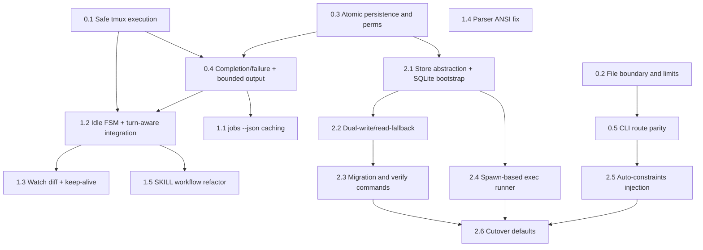

# Plan: Comprehensive Refactor of codex-orchestrator
**Generated**: 2026-02-17 (updated post-upstream-merge)
**Estimated Complexity**: High

## Overview
This plan addresses 25 reviewed issues with pragmatic scope for a local developer CLI. After merging upstream commit `635299f` (turn-aware orchestration, notify hooks, output-cleaner), the plan is adjusted to avoid duplicating already-fixed items and to incorporate new upstream code into scope.

**Upstream merge impact**: Issues #17 (deleteJob .log) and #20 (ANSI regex) are resolved by upstream. New files `src/watcher.ts`, `src/notify-hook.ts`, `src/output-cleaner.ts`, `bin/codex-bg` are now in scope for security/persistence hardening.

## Prerequisites
- ~~Merge upstream turn-aware orchestration~~ **DONE** (commit `270f2fe`)
- Create a working branch and back up `~/.codex-agent/jobs` before touching persistence logic.
- Confirm baseline commands: `bun run build`, `codex-agent jobs`, `codex-agent start --dry-run "test"`.
- For P2, require `bun` with `bun:sqlite` support and documented fallback env flags.
- Keep compatibility goal explicit: existing JSON jobs must remain readable during migration.

## Phase 0: P0 Critical Fixes
### Task 0.1: Replace shell-string tmux orchestration with argv-safe execution
- **Location**: `src/tmux.ts`, `src/jobs.ts`
- **Description**: Fix issues #1, #9, #15, #18. Replace interpolated `execSync` calls with `execFileSync`/`spawnSync` using argv arrays. Generate executable launcher scripts in jobs dir instead of embedding shell strings. Make `script` invocation OS-aware (BSD vs GNU). Pass reasoning effort to exec mode. Remove unconditional `"3"` keypress path. **Post-merge addition**: ensure notify hook path in interactive codex args is also argv-safe (currently string-interpolated).
- **Dependencies**: None
- **Parallelizable**: Yes (with Tasks 0.2, 0.3)
- **Complexity**: 8
- **Acceptance Criteria**: Prompts/paths with quotes do not break session launch; interactive logging works on macOS and Linux; exec mode includes reasoning flag; no blind update-menu input; notify hook path cannot be injected.

### Task 0.2: Harden file context loading boundaries and volume guards
- **Location**: `src/files.ts`, `src/config.ts`, `src/cli.ts`
- **Description**: Fix issues #2, #8, #16. Enforce base-directory boundary checks on glob matches, add default excludes (`.git`, `node_modules`, `dist`, `.codex`), add max file-count limits. Correct negation behavior to remove already-added files from output list, not only `seen`.
- **Dependencies**: None
- **Parallelizable**: Yes (with Tasks 0.1, 0.3)
- **Complexity**: 6
- **Acceptance Criteria**: Patterns cannot include files outside `baseDir`; large glob sets fail fast with clear error; negation reliably excludes previously matched files.

### Task 0.3: Make job persistence atomic and permission-explicit
- **Location**: `src/jobs.ts`, `src/watcher.ts`
- **Description**: Fix issues #3 and #6. Set explicit permissions (`jobsDir` 0700, job files 0600) and replace direct `writeFileSync` with temp-file + rename atomic writes. **Post-merge addition**: also apply atomic writes to `src/watcher.ts` (`updateJobTurn`, `setJobTurnWorking`, `writeSignalFile`) which upstream introduced with the same non-atomic pattern.
- **Dependencies**: None
- **Parallelizable**: Yes (with Tasks 0.1, 0.2)
- **Complexity**: 6

```ts
// Extract shared helper for all job file writes
function atomicWriteFileSync(filePath: string, data: string, mode = 0o600): void {
  const tmpPath = `${filePath}.${process.pid}.${Date.now()}.tmp`;
  writeFileSync(tmpPath, data, { mode });
  renameSync(tmpPath, filePath);
}
```
- **Acceptance Criteria**: All job/signal file writes are atomic; new jobs directory/files created with restrictive modes; interrupted writes do not leave torn JSON.

### Task 0.4: Distinguish failure vs completion and cap persisted output size
- **Location**: `src/jobs.ts`, `src/cli.ts`
- **Description**: Fix issues #7 and #11. Stop full-output embedding in `job.result`. Use log-file pointers plus bounded previews. Treat missing session without completion marker as failed (not completed). **Post-merge note**: upstream's `turnState` field helps track agent state, but `refreshJobStatus` still stores full output on completion.
- **Dependencies**: Task 0.1, Task 0.3
- **Parallelizable**: No
- **Complexity**: 7
- **Acceptance Criteria**: Forced session loss yields `failed` with reason; normal completion remains `completed`; job JSON size stays bounded regardless of log size.

### Task 0.5: Unify explicit `start` and default-route prompt assembly
- **Location**: `src/cli.ts`
- **Description**: Fix issue #4. Extract shared prompt assembly (files + codebase map + dry-run + --wait behavior) used by both `start` and default command route. **Post-merge note**: default route also lacks `--wait`/`--notify-on-complete` support that `start` has — unify these too.
- **Dependencies**: Task 0.2
- **Parallelizable**: Yes (after Task 0.2)
- **Complexity**: 4
- **Acceptance Criteria**: `codex-agent "prompt" -f "src/**/*.ts" --map --dry-run` behaves equivalently to `codex-agent start ...`, including --wait support.

## Phase 1: P1 Bug Fixes + UX
### Task 1.1: Reduce `jobs --json` metadata scan cost with cache-aware enrichment
- **Location**: `src/jobs.ts`, `src/session-parser.ts`
- **Description**: Fix issue #5. Limit enrichment to post-sort/post-limit jobs and cache parsed session metadata keyed by source file + mtime. Avoid recursive parse of every completed job on each invocation.
- **Dependencies**: Task 0.4
- **Parallelizable**: Yes (with Tasks 1.4, 1.5)
- **Complexity**: 6
- **Acceptance Criteria**: Repeated `jobs --json` on large history avoids re-reading unchanged session files.

### Task 1.2: Harden idle state machine and integrate with turn-aware detection
- **Location**: `src/jobs.ts`, `src/tmux.ts`, `src/config.ts`, `src/cli.ts`
- **Description**: Fix issues #13, #14, #24. **Adjusted post-merge**: upstream's notify hook + `await-turn` partially addresses #12 (passive polling) for interactive mode. Focus remaining work on: tightening idle detection regex (replace `? for shortcuts` with more specific pattern), fixing send/exit race condition, and splitting inactivity timeout defaults by mode (exec: 60 min, interactive: 120 min) to resolve SKILL.md's "60+ min is normal" vs config conflict.
- **Dependencies**: Task 0.1, Task 0.4
- **Parallelizable**: No
- **Complexity**: 6 *(reduced from 8 — turn-aware detection handles part of #12)*
- **Acceptance Criteria**: False positives from generic text are eliminated; send/exit race is deterministic; interactive timeout extended to 120 min.

### Task 1.3: Stabilize watch diffing and implement `--keep-alive`
- **Location**: `src/cli.ts`, `src/jobs.ts`, `docs/usage-guide.md`
- **Description**: Fix issues #10, #19. Replace `output.replace(lastOutput, "")` with offset/line-based diff logic. Implement CLI `--keep-alive` to disable interactive auto-exit. **Post-merge note**: #17 (deleteJob .log) already fixed by upstream — remove from scope.
- **Dependencies**: Task 1.2
- **Parallelizable**: No
- **Complexity**: 5 *(reduced from 6 — #17 already done)*
- **Acceptance Criteria**: `watch` stops duplicate/spam output during scrollback changes; `--keep-alive` is parseable and effective.

### Task 1.4: Fix ANSI stripping in session parser
- **Location**: `src/session-parser.ts`
- **Description**: Fix issue #20 residual. **Adjusted post-merge**: upstream added `output-cleaner.ts` which handles CLI output cleaning. But `session-parser.ts:194-196` still has its own `stripAnsiCodes` with the broken regex (`/\[[\d;]*m/g` without `\x1b` prefix). Fix this local function. The upstream `output-cleaner.ts` handles the CLI-facing output.
- **Dependencies**: None
- **Parallelizable**: Yes (with Tasks 1.1, 1.5)
- **Complexity**: 2 *(reduced from 3 — only session-parser's local regex needs fixing)*
- **Acceptance Criteria**: Session IDs are extracted from ANSI-decorated logs; plain logs continue to parse correctly.

### Task 1.5: Refactor SKILL workflow for practical multi-agent collaboration
- **Location**: `plugins/codex-orchestrator/skills/codex-orchestrator/SKILL.md`, `docs/usage-guide.md`
- **Description**: Fix issues #21, #22, #23 (and align issue #24 messaging). Remove shared-single-file `agents.log` guidance (replace with per-job log files in `~/.codex-agent/jobs/`). Add trivial-task bypass ("< 50 lines, single file → use native Claude tools"). Add explicit review → fix → re-review loop. **Post-merge note**: upstream added turn-aware orchestration docs — build on those patterns rather than replacing them.
- **Dependencies**: Task 1.2
- **Parallelizable**: Yes (after Task 1.2)
- **Complexity**: 5
- **Acceptance Criteria**: SKILL no longer mandates Codex for trivial edits, no longer recommends unsafe shared `agents.log` writes, and documents a concrete remediation loop after review findings.

## Phase 2: P2 Architecture Modernization
### Task 2.1: Introduce storage abstraction and SQLite schema bootstrap
- **Location**: `src/jobs.ts`, `src/config.ts`, `src/store/job-store.ts` (new), `src/store/json-store.ts` (new), `src/store/sqlite-store.ts` (new)
- **Description**: Create a `JobStore` interface and isolate persistence behind it. Add SQLite schema via `bun:sqlite` with schema versioning tables while preserving current JSON store behavior. **Post-merge note**: the `JobStore` interface must also cover signal file operations (`writeSignal`, `readSignal`, `clearSignal`) from `src/watcher.ts`.
- **Dependencies**: Task 0.3
- **Parallelizable**: No
- **Complexity**: 8

```ts
interface JobStore {
  save(job: Job): void;
  load(jobId: string): Job | null;
  list(): Job[];
  remove(jobId: string): boolean;
  // Signal file operations (from watcher.ts)
  writeSignal(jobId: string, event: TurnEvent): void;
  readSignal(jobId: string): TurnEvent | null;
  clearSignal(jobId: string): void;
}
```
- **Acceptance Criteria**: Existing commands behave unchanged in `json` mode; SQLite DB initializes automatically in `dual/sqlite`; store mode is switchable without code edits.

### Task 2.2: Implement incremental dual-write and read-fallback migration path
- **Location**: `src/jobs.ts`, `src/store/sqlite-store.ts`, `src/store/json-store.ts`
- **Description**: Dual-write new state to JSON+SQLite, prefer SQLite reads with JSON fallback, lazily backfill JSON-only jobs on read. Add conflict handling using `updatedAt` monotonic checks.
- **Dependencies**: Task 2.1
- **Parallelizable**: Yes (with Task 2.4, Task 2.5)
- **Complexity**: 9
- **Acceptance Criteria**: Legacy JSON jobs still visible; new jobs queryable from both stores; switching back to `json` mode restores prior behavior.

### Task 2.3: Add explicit migration/verification CLI workflows
- **Location**: `src/cli.ts`, `src/store/migrate.ts` (new)
- **Description**: Add `migrate` and `verify-storage` commands for one-time bulk import and idempotent integrity checks.
- **Dependencies**: Task 2.2
- **Parallelizable**: No
- **Complexity**: 6
- **Acceptance Criteria**: Migration runs repeatedly without duplicates; verification catches mismatches and reports actionable remediation.

### Task 2.4: De-tmux-ify exec mode using `child_process.spawn`
- **Location**: `src/jobs.ts`, `src/cli.ts`, `src/exec-runner.ts` (new), `src/tmux.ts`
- **Description**: Exec mode runs as direct spawned process with streamed logs and tracked PID/exit code; interactive mode remains tmux-only with notify hooks. Update `kill/status/output/watch/await-turn` branches by runner type. Remove tmux requirement for exec mode startup.
- **Dependencies**: Task 2.1
- **Parallelizable**: Yes (with Tasks 2.2, 2.5)
- **Complexity**: 10
- **Acceptance Criteria**: Non-interactive jobs start and complete without tmux installed; interactive jobs still use tmux + send + notify hooks; exec completion/failure derives from real process exit codes.

```ts
const child = spawn("codex", execArgs, { cwd, stdio: ["pipe", "pipe", "pipe"] });
child.stdin.end(promptText);
child.stdout.pipe(logStream);
child.stderr.pipe(logStream);
child.on("exit", (code) => { /* mark completed or failed based on exit code */ });
```

### Task 2.5: Auto-inject mandatory prompt constraints in CLI
- **Location**: `src/cli.ts`, `src/files.ts`, `src/prompt-constraints.ts` (new), `plugins/codex-orchestrator/skills/codex-orchestrator/SKILL.md`
- **Description**: Fix issue #25. Make constraint blocks programmatic instead of relying on LLM memory. Add merge logic that injects required blocks once, preserves explicit user blocks, supports opt-out (`--no-constraints`).
- **Dependencies**: Task 0.5
- **Parallelizable**: Yes (with Tasks 2.2, 2.4)
- **Complexity**: 7
- **Acceptance Criteria**: Dry-run prompts consistently include required constraints exactly once; user-specified constraints not duplicated; opt-out emits raw prompt.

### Task 2.6: Cutover defaults and retire legacy paths safely
- **Location**: `src/config.ts`, `src/jobs.ts`, `src/cli.ts`, `docs/usage-guide.md`, `plugins/codex-orchestrator/skills/codex-orchestrator/SKILL.md`
- **Description**: Flip default storage to SQLite and default exec runner to spawn path; keep rollback env flags for one release window. Remove dead code while preserving interactive tmux mode.
- **Dependencies**: Task 2.3, Task 2.4, Task 2.5
- **Parallelizable**: No
- **Complexity**: 6
- **Acceptance Criteria**: Fresh installs use SQLite + spawn exec by default; rollback flags restore prior behavior; docs and skill text match shipped behavior.

## Testing Strategy
- Use phased smoke validation because the project currently has no test suite and no linter.
- Baseline for every task: `bun run build` must pass.
- Upstream's `src/output-cleaner.test.ts` is the first test file in the project — extend this pattern.
- Add lightweight regression scripts: parser fixtures, file-loader boundary checks, storage verification scripts.
- Manual CLI matrix per phase: start (explicit/default), dry-run with files/map, watch output stability, interactive send/idle/await-turn behavior, delete cleanup, migration verify, exec without tmux.
- Migration safety checks for P2: row counts, checksum parity for sampled jobs, JSON fallback read success, rollback-flag drills.

## Dependency Graph (mermaid)


## Changes from Pre-Merge Plan
| Item | Before | After |
|------|--------|-------|
| Task 0.1 scope | tmux.ts only | + notify hook path safety |
| Task 0.3 scope | jobs.ts only | + watcher.ts atomic writes |
| Task 0.5 scope | file/map only | + --wait/--notify parity |
| Task 1.2 complexity | 8 | 6 (turn-aware handles #12 partial) |
| Task 1.3 scope | + deleteJob .log | removed (upstream fixed #17) |
| Task 1.4 complexity | 3 | 2 (only session-parser local regex) |
| Task 2.1 interface | Job CRUD only | + signal file operations |
| Task 2.4 scope | basic spawn | + await-turn integration |
| Issues #17, #20 | planned | resolved by upstream merge |

## Potential Risks
- Cross-platform launcher behavior may still differ between macOS and Linux shells; mitigate with explicit OS branches and smoke scripts.
- Background monitor process can leak/orphan if not lifecycle-managed; mitigate with PID tracking and cleanup.
- Dual-write migration can drift if conflict resolution is weak; mitigate with monotonic `updatedAt` checks.
- Spawn-based exec mode changes kill/status semantics; mitigate with runner-type abstraction and temporary rollback flag.
- Auto-injected constraints can surprise advanced users; mitigate with `--no-constraints` opt-out.
- Upstream notify hook uses `import.meta.dir` which may not resolve correctly in all Bun build configurations.

## Rollback Plan
- Keep rollback toggles: `CODEX_AGENT_STORAGE=json`, `CODEX_AGENT_EXEC_RUNNER=tmux`.
- Before each phase, snapshot `~/.codex-agent/jobs` and generated SQLite DB file.
- If P0/P1 regressions occur, revert affected task commit only.
- If P2 migration regresses, switch to `json` mode immediately, keep SQLite artifacts for forensics.
- Keep interactive tmux mode untouched as stable fallback until final cutover.
- Git revert of merge commit is always available as nuclear option.
