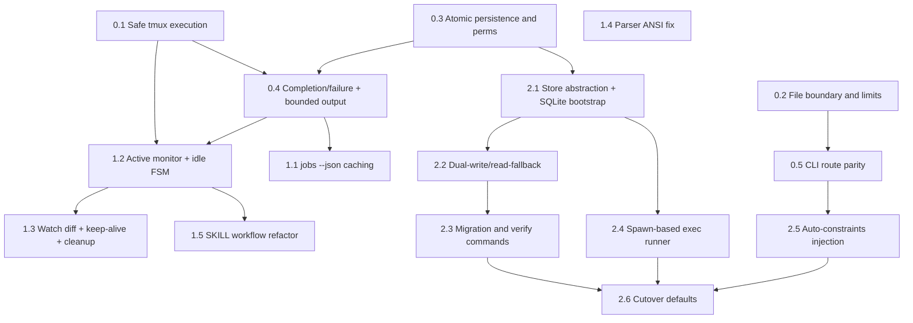

# Plan: Comprehensive Refactor of codex-orchestrator
**Generated**: 2026-02-17
**Estimated Complexity**: High

## Overview
This plan addresses all 25 reviewed issues with pragmatic scope for a local developer CLI. Work is split into three phases: P0 critical correctness/safety, P1 bug fixes and UX reliability, and P2 architecture modernization (incremental SQLite migration, exec-mode de-tmux-ification, and automatic prompt constraints).

## Prerequisites
- Create a working branch and back up `~/.codex-agent/jobs` before touching persistence logic.
- Confirm baseline commands: `bun run build`, `codex-agent jobs`, `codex-agent start --dry-run "test"`.
- For P2, require `bun` with `bun:sqlite` support and documented fallback env flags.
- Keep compatibility goal explicit: existing JSON jobs must remain readable during migration.

## Phase 0: P0 Critical Fixes
### Task 0.1: Replace shell-string tmux orchestration with argv-safe execution
- **Location**: `src/tmux.ts`, `src/jobs.ts`
- **Description**: Fix issues #1, #9, #15, #18 by replacing interpolated `execSync` calls with `execFileSync`/`spawnSync` wrappers using argv arrays. Generate executable launcher files in jobs dir instead of embedding shell strings. Make `script` invocation OS-aware (BSD vs GNU) and pass reasoning effort to exec mode. Remove unconditional `"3"` keypress path.
- **Dependencies**: None
- **Parallelizable**: Yes (with Tasks 0.2, 0.3)
- **Complexity**: 8
- **Acceptance Criteria**: Prompts/paths with quotes do not break session launch; interactive logging works on macOS and Linux; exec mode includes reasoning flag and no blind update-menu input.

### Task 0.2: Harden file context loading boundaries and volume guards
- **Location**: `src/files.ts`, `src/config.ts`, `src/cli.ts`
- **Description**: Fix issues #2, #8, #16 by enforcing base-directory boundary checks on glob matches, adding default excludes (`.git`, `node_modules`, `dist`, `.codex`), and adding max file-count limits in addition to per-file size limits. Correct negation behavior to remove already-added files from output list, not only `seen`.
- **Dependencies**: None
- **Parallelizable**: Yes (with Tasks 0.1, 0.3)
- **Complexity**: 6
- **Acceptance Criteria**: Patterns cannot include files outside `baseDir`; large glob sets fail fast with clear error; negation reliably excludes previously matched files.

### Task 0.3: Make job persistence atomic and permission-explicit
- **Location**: `src/jobs.ts`
- **Description**: Fix issues #3 and #6 by setting explicit permissions (`jobsDir` 0700, job files 0600) and replacing direct `writeFileSync` with temp-file + rename atomic writes. Ensure partial writes cannot corrupt job JSON on process interruption.
- **Dependencies**: None
- **Parallelizable**: Yes (with Tasks 0.1, 0.2)
- **Complexity**: 5
- **Acceptance Criteria**: New jobs directory/files are created with explicit restrictive modes; interrupted writes do not leave torn JSON in canonical job path.

```ts
const tmpPath = `${jobPath}.${process.pid}.${Date.now()}.tmp`;
writeFileSync(tmpPath, payload, { mode: 0o600 });
renameSync(tmpPath, jobPath); // atomic on same filesystem
```

### Task 0.4: Distinguish failure vs completion and cap persisted output size
- **Location**: `src/jobs.ts`, `src/cli.ts`
- **Description**: Fix issues #7 and #11 by introducing explicit completion reason/exit metadata and by stopping full-output embedding in `job.result`. Use log-file pointers plus bounded previews in job JSON to prevent OOM and oversized metadata. Treat missing session without completion marker as failed (not completed).
- **Dependencies**: Task 0.1, Task 0.3
- **Parallelizable**: No
- **Complexity**: 7
- **Acceptance Criteria**: Forced session loss yields `failed` with reason; normal completion remains `completed`; job JSON size stays bounded regardless of log size.

### Task 0.5: Unify explicit `start` and default-route prompt assembly
- **Location**: `src/cli.ts`
- **Description**: Fix issue #4 by extracting shared prompt assembly (files + codebase map + dry-run behavior) used by both `start` and default command route. Remove duplicated job-start code paths that drift behavior.
- **Dependencies**: Task 0.2
- **Parallelizable**: Yes (after Task 0.2)
- **Complexity**: 4
- **Acceptance Criteria**: `codex-agent "prompt" -f "src/**/*.ts" --map --dry-run` behaves equivalently to `codex-agent start ...`.

## Phase 1: P1 Bug Fixes + UX
### Task 1.1: Reduce `jobs --json` metadata scan cost with cache-aware enrichment
- **Location**: `src/jobs.ts`, `src/session-parser.ts`
- **Description**: Fix issue #5 by limiting enrichment to post-sort/post-limit jobs and caching parsed session metadata keyed by source file + mtime. Avoid recursive parse of every completed job on each invocation.
- **Dependencies**: Task 0.4
- **Parallelizable**: Yes (with Tasks 1.4, 1.5)
- **Complexity**: 6
- **Acceptance Criteria**: Repeated `jobs --json` on large history avoids re-reading unchanged session files and returns equivalent output fields.

### Task 1.2: Add active status monitor and harden idle state machine
- **Location**: `src/jobs.ts`, `src/tmux.ts`, `src/config.ts`, `src/cli.ts`
- **Description**: Fix issues #12, #13, #14, #24 by adding detached background monitoring for interactive jobs, tightening idle detection pattern matching, and replacing `exitSent` boolean with explicit exit state transitions. Split inactivity timeout defaults by mode so documented long interactive sessions are not prematurely killed.
- **Dependencies**: Task 0.1, Task 0.4
- **Parallelizable**: No
- **Complexity**: 8
- **Acceptance Criteria**: Idle auto-exit works without manual `refreshJobStatus` calls; false positives from generic `? for shortcuts` text are eliminated; send/exit race is deterministic and recoverable.

### Task 1.3: Stabilize watch diffing, implement `--keep-alive`, and complete artifact cleanup
- **Location**: `src/cli.ts`, `src/jobs.ts`, `docs/usage-guide.md`
- **Description**: Fix issues #10, #17, #19 by replacing `output.replace(lastOutput, "")` with offset/line-based diff logic, implementing CLI `--keep-alive` to disable interactive auto-exit, and extending `deleteJob` cleanup to remove `.log` and cache artifacts.
- **Dependencies**: Task 1.2
- **Parallelizable**: No
- **Complexity**: 6
- **Acceptance Criteria**: `watch` stops duplicate/spam output during scrollback changes; `--keep-alive` is parseable and effective; deleting a job removes JSON, log, prompt, and metadata cache files.

### Task 1.4: Fix ANSI stripping bug in session parser and add regression fixtures
- **Location**: `src/session-parser.ts`, `docs/usage-guide.md` (parser behavior notes)
- **Description**: Fix issue #20 by correcting ANSI regex handling in `stripAnsiCodes` so all expected escape forms are removed before session-id parsing. Add lightweight fixture-based validation script for parser regressions (no full test framework required).
- **Dependencies**: None
- **Parallelizable**: Yes (with Tasks 1.1, 1.5)
- **Complexity**: 3
- **Acceptance Criteria**: Session IDs are extracted from ANSI-decorated logs; plain logs continue to parse correctly.

### Task 1.5: Refactor SKILL workflow for practical multi-agent collaboration
- **Location**: `plugins/codex-orchestrator/skills/codex-orchestrator/SKILL.md`, `docs/usage-guide.md`
- **Description**: Fix issues #21, #22, #23 (and align issue #24 messaging) by removing shared-single-file logging guidance, adding a trivial-task bypass path, and adding an explicit review -> fix -> re-review loop. Align documented timing expectations with mode-specific timeout behavior.
- **Dependencies**: Task 1.2
- **Parallelizable**: Yes (after Task 1.2)
- **Complexity**: 5
- **Acceptance Criteria**: SKILL no longer mandates Codex for trivial edits, no longer recommends unsafe shared `agents.log` writes, and documents a concrete remediation loop after review findings.

## Phase 2: P2 Architecture Modernization
### Task 2.1: Introduce storage abstraction and SQLite schema bootstrap
- **Location**: `src/jobs.ts`, `src/config.ts`, `src/store/job-store.ts` (new), `src/store/json-store.ts` (new), `src/store/sqlite-store.ts` (new)
- **Description**: Create a `JobStore` interface and isolate persistence behind it. Add SQLite schema via `bun:sqlite` with schema versioning tables while preserving current JSON store behavior. Add config/flag to select `json`, `dual`, or `sqlite` storage mode.
- **Dependencies**: Task 0.3
- **Parallelizable**: No
- **Complexity**: 8
- **Acceptance Criteria**: Existing commands behave unchanged in `json` mode; SQLite DB initializes automatically in `dual/sqlite`; store mode is switchable without code edits.

```ts
interface JobStore {
  save(job: Job): void;
  load(jobId: string): Job | null;
  list(): Job[];
  remove(jobId: string): boolean;
}
```

### Task 2.2: Implement incremental dual-write and read-fallback migration path
- **Location**: `src/jobs.ts`, `src/store/sqlite-store.ts`, `src/store/json-store.ts`
- **Description**: Meet migration constraint by dual-writing new state to JSON+SQLite, preferring SQLite reads with JSON fallback, and lazily backfilling JSON-only jobs on read. Add conflict handling using `updatedAt` monotonic checks to avoid stale overwrites.
- **Dependencies**: Task 2.1
- **Parallelizable**: Yes (with Task 2.4, Task 2.5)
- **Complexity**: 9
- **Acceptance Criteria**: Legacy JSON jobs are still visible; new jobs are queryable from both stores during transition; switching back to `json` mode restores prior behavior.

### Task 2.3: Add explicit migration/verification CLI workflows
- **Location**: `src/cli.ts`, `src/store/migrate.ts` (new)
- **Description**: Add `migrate` and `verify-storage` commands for one-time bulk import and idempotent integrity checks. Include dry-run output, mismatch reporting, and non-zero exit on verification failure.
- **Dependencies**: Task 2.2
- **Parallelizable**: No
- **Complexity**: 6
- **Acceptance Criteria**: Migration can run repeatedly without duplicates; verification catches row-count/hash mismatches and reports actionable remediation.

### Task 2.4: De-tmux-ify exec mode using `child_process.spawn`
- **Location**: `src/jobs.ts`, `src/cli.ts`, `src/exec-runner.ts` (new), `src/tmux.ts`
- **Description**: Implement P2 core change: exec mode runs as direct spawned process with streamed logs and tracked PID/exit code; interactive mode remains tmux-only. Update `kill/status/output/watch` branches by runner type and remove tmux requirement for exec mode startup.
- **Dependencies**: Task 2.1
- **Parallelizable**: Yes (with Tasks 2.2, 2.5)
- **Complexity**: 10
- **Acceptance Criteria**: Non-interactive jobs start and complete without tmux installed; interactive jobs still use tmux + send; exec completion/failure derives from real process exit codes.

```ts
const child = spawn("codex", execArgs, { cwd, stdio: ["pipe", "pipe", "pipe"] });
child.stdin.end(promptText);
child.stdout.pipe(logStream);
child.stderr.pipe(logStream);
```

### Task 2.5: Auto-inject mandatory prompt constraints in CLI
- **Location**: `src/cli.ts`, `src/files.ts`, `src/prompt-constraints.ts` (new), `plugins/codex-orchestrator/skills/codex-orchestrator/SKILL.md`
- **Description**: Fix issue #25 by making constraint blocks programmatic instead of memory/manual copy-paste. Add merge logic that injects required blocks once, preserves explicit user blocks, and supports opt-out (`--no-constraints`) for edge cases.
- **Dependencies**: Task 0.5
- **Parallelizable**: Yes (with Tasks 2.2, 2.4)
- **Complexity**: 7
- **Acceptance Criteria**: Dry-run prompts consistently include required constraints exactly once; user-specified constraints are not duplicated; opt-out emits raw prompt.

### Task 2.6: Cutover defaults and retire legacy paths safely
- **Location**: `src/config.ts`, `src/jobs.ts`, `src/cli.ts`, `docs/usage-guide.md`, `plugins/codex-orchestrator/skills/codex-orchestrator/SKILL.md`
- **Description**: After soak, flip default storage to SQLite and default exec runner to spawn path; keep rollback env flags for one release window. Remove dead assumptions from JSON-heavy and tmux-exec code paths while preserving interactive tmux mode.
- **Dependencies**: Task 2.3, Task 2.4, Task 2.5
- **Parallelizable**: No
- **Complexity**: 6
- **Acceptance Criteria**: Fresh installs use SQLite + spawn exec by default; rollback flags restore prior behavior; docs and skill text match shipped behavior.

## Testing Strategy
- Use phased smoke validation because the project currently has no test suite and no linter.
- Baseline for every task: `bun run build` must pass.
- Add lightweight regression scripts (no framework migration): parser fixtures, file-loader boundary checks, and storage verification scripts invoked from `scripts/`.
- Manual CLI matrix per phase: start (explicit/default), dry-run with files/map, watch output stability, interactive send/idle behavior, delete cleanup, migration verify, exec without tmux.
- Migration safety checks for P2: row counts, checksum/hash parity for sampled jobs, JSON fallback read success, rollback-flag drills.

## Dependency Graph (mermaid)


## Potential Risks
- Cross-platform launcher behavior may still differ between macOS and Linux shells; mitigate with explicit OS branches and smoke scripts on both.
- Background monitor process can leak/orphan if not lifecycle-managed; mitigate with PID tracking and cleanup on completion/delete.
- Dual-write migration can drift if conflict resolution is weak; mitigate with monotonic `updatedAt` checks plus verification command.
- Spawn-based exec mode changes kill/status semantics; mitigate with runner-type abstraction and temporary rollback flag.
- Auto-injected constraints can surprise advanced users; mitigate with explicit `--no-constraints` opt-out and dry-run visibility.

## Rollback Plan
- Keep rollback toggles throughout refactor window: `CODEX_AGENT_STORAGE=json`, `CODEX_AGENT_EXEC_RUNNER=tmux`, and disable monitor flag for idle handling if needed.
- Before each phase, snapshot `~/.codex-agent/jobs` and generated SQLite DB file.
- If P0/P1 regressions occur, revert affected task commit only; tasks are intentionally grouped as cohesive logical commits.
- If P2 migration regresses, switch to `json` mode immediately, keep SQLite artifacts for forensics, and re-run verification after fix.
- Keep interactive tmux mode untouched as stable fallback until final cutover task completes.
