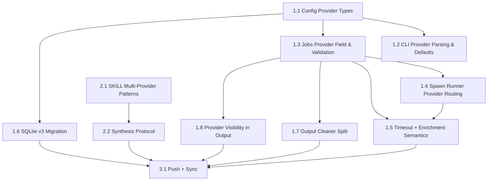

# Plan: Multi-Provider Support (OpenAI + Gemini) for codex-orchestrator
**Generated**: 2026-02-23
**Estimated Complexity**: Medium

## Overview
This PRD defines a minimal Phase 1 implementation (~120 lines of TypeScript) to add `--provider openai|gemini` to `codex-orchestrator`, while keeping the CLI as a job multiplexer only. Consensus/synthesis behavior is intentionally moved to `SKILL.md` (Phase 2, zero code). The plan incorporates final decisions from Gemini, Codex, Sonnet, and Opus analyses and is directly executable as `codex-plan.md`.

## Problem Statement
`codex-orchestrator` currently hardcodes OpenAI Codex execution paths (`codex exec`) and cannot launch Gemini CLI jobs. This blocks provider diversity, limits cross-model review workflows, and prevents task routing by provider strengths (for example, Gemini for context-heavy analysis). The product need is not an in-CLI consensus engine; it is provider-agnostic job dispatch plus clear orchestration patterns at the skill layer.

## Design Decisions
1. CLI is a job multiplexer, not a consensus engine.
- Decision: add `--provider openai|gemini` only; no multi-dispatch, no `groupId`, no `await-group`.
- Rationale: Opus/Sonnet identify orchestration policy as SKILL-layer concern; keeping CLI primitive prevents abstraction lock-in.

2. Replace “consensus mode” with “multi-provider patterns” in `SKILL.md`.
- Decision: document Pattern A (parallel analysis), Pattern B (generate -> adversarial review), Pattern C (specialist routing).
- Rationale: Gemini/Opus show one-size consensus is weaker than task-fit patterns.

3. Drop self-reported scoring completely.
- Decision: remove any `Security: X/10` style guidance.
- Rationale: Gemini/Codex/Sonnet agree score calibration is unreliable and noisy.

4. Anonymous synthesis.
- Decision: relabel outputs as `Analysis Alpha` and `Analysis Beta` with randomized assignment before synthesis.
- Rationale: Opus highlights provider-identity bias and output-length anchoring risks.

5. Gemini Phase 1 defaults.
- Decision: default Gemini jobs to `--no-constraints`, spawn runner only, enrichment null.
- Rationale: existing XML auto-constraints are Codex-tuned; tmux path is Codex-specific; session-parser is Codex-format specific.

## Architecture
Current architecture keeps explicit branching by provider:
- `src/cli.ts` selects provider and provider-specific defaults.
- `src/jobs.ts` stores provider on each job, validates runner compatibility, and enforces provider timeout behavior.
- `src/spawn-runner.ts` builds provider-specific launcher scripts (`codex` vs `gemini`) and uses common spawn mechanics.
- `src/output-cleaner.ts` performs two-stage cleaning: provider-agnostic control stripping plus provider-specific chrome filtering.
- `src/store/sqlite-store.ts` persists provider metadata via schema v3 migration.

Future ceiling (explicitly deferred): when a 3rd provider is added, refactor branch logic to a `ProviderAdapter` interface. Phase 1 intentionally uses `if/else` branching only.

## Out of Scope
- Gemini interactive/TUI mode (`tmux`) support.
- Gemini enrichment/session parsing (tokens/files_modified summary) beyond `null`.
- Any CLI consensus commands/subcommands/state machines (`consensus`, `await-group`, retries/escalation gates).
- Programmatic quality gates in code (score thresholds, finding-count thresholds).
- `watch` behavior redesign for spawn jobs.

## Success Metrics
- `codex-agent start "..." --provider gemini` launches and completes via spawn runner with correct status transitions.
- Non-zero provider exit codes are preserved accurately (no false `completed` classification).
- `jobs`, `status`, and `jobs --json` expose provider clearly.
- Output cleaning removes control sequences and provider chrome without over-stripping Gemini substantive content.
- SKILL-driven synthesis produces actionable contradiction lists with evidence and no provider-name bias.

## Risks & Mitigations
- Correlated failures (shared training canon): restrict cross-provider synthesis value to analytical reasoning on project-specific code; avoid treating agreement as proof.
- File system races in parallel execution: SKILL rule requires at least one provider read-only in Pattern A; CLI defaults Gemini sandbox to read-only unless explicitly set.
- Silent hangs (CLI waiting/input ambiguity): keep spawn/headless only for Gemini, retain mtime inactivity detection, add hard max runtime (default 30 min).
- Calibration mismatch/noisy scoring: ban self-scoring; require evidence-based synthesis checklist.
- Identity/length bias in synthesis: enforce anonymous Alpha/Beta relabeling before judgment.

## Prerequisites
- Bun runtime and existing build workflow (`bun run build`).
- OpenAI Codex CLI available for `openai` provider flows.
- Gemini CLI available for `gemini` provider flows.
- Existing storage migration path operational (`src/store/sqlite-store.ts`).

## Phase 1: Multi-Provider CLI Runtime (Code)
**Goal**: Add provider selection and safe Gemini execution while preserving current OpenAI behavior.

### Task 1.1: Add Provider Types and Provider Defaults
- **Location**: `src/config.ts:3`, `src/config.ts:8`, `src/config.ts:10`, `src/config.ts:18`
- **Description**: Add `Provider` type and config defaults:
  - `provider` default (`openai`)
  - `providers` enum list
  - `geminiDefaultModel`
  - configurable Gemini hard max runtime (default 30 min)
- **Dependencies**: None
- **Complexity**: 2/10
- **Test-First Approach**: Build should fail before changes when `Provider` is referenced in downstream files; then compile succeeds after type addition.
- **Acceptance Criteria**:
  - `Provider` type exported as `"openai" | "gemini"`.
  - Config exposes `provider`, `providers`, `geminiDefaultModel`, `geminiHardMaxRuntimeMinutes`.

**Snippet**
```ts
export type Provider = "openai" | "gemini";

provider: (process.env.CODEX_AGENT_PROVIDER || "openai") as Provider,
providers: ["openai", "gemini"] as const,
geminiDefaultModel: process.env.CODEX_AGENT_GEMINI_MODEL || "gemini-3.1-pro",
geminiHardMaxRuntimeMinutes: Number(process.env.CODEX_AGENT_GEMINI_HARD_MAX_MINUTES || 30),
```

### Task 1.2: CLI Provider Parsing and Gemini Defaults
- **Location**: `src/cli.ts:102`, `src/cli.ts:122`, `src/cli.ts:150`, `src/cli.ts:323`, `src/cli.ts:372`, `src/cli.ts:769`
- **Description**:
  - Add `--provider openai|gemini` parsing.
  - Track explicitness for `--sandbox`, `--model`, `--no-constraints` so provider defaults apply only when user did not set them.
  - Apply Gemini defaults: `noConstraints=true`, sandbox default `read-only`, model default `config.geminiDefaultModel`.
  - Fix tmux check to run only for interactive mode.
  - Pass provider into `startJob()` and show provider in start/status/jobs output.
- **Dependencies**: Task 1.1
- **Complexity**: 5/10
- **Test-First Approach**:
  - Parse test matrix (manual CLI smoke):
    - `--provider gemini` without `-s` resolves sandbox `read-only`.
    - `--provider gemini -s workspace-write` preserves explicit sandbox.
    - `--provider gemini` without `--no-constraints` auto-enables no-constraints.
  - `--interactive` without tmux should fail; non-interactive spawn should not require tmux.
- **Acceptance Criteria**:
  - Invalid provider value exits with non-zero and valid options message.
  - `status` and `jobs` include provider field/column.
  - Start path no longer hard-fails for missing tmux in non-interactive mode.

**Snippet**
```ts
} else if (arg === "--provider") {
  const provider = args[++i] as Provider;
  if (!(config.providers as readonly string[]).includes(provider)) {
    console.error(`Invalid provider: ${provider}`);
    process.exit(1);
  }
  options.provider = provider;
}

if (options.provider === "gemini") {
  if (!options.sandboxExplicit) options.sandbox = "read-only";
  if (!options.modelExplicit) options.model = config.geminiDefaultModel;
  if (!options.noConstraintsExplicit) options.noConstraints = true;
}
```

### Task 1.3: Job Model, Provider Propagation, and Compatibility Validation
- **Location**: `src/jobs.ts:24`, `src/jobs.ts:139`, `src/jobs.ts:242`, `src/jobs.ts:253`, `src/jobs.ts:257`, `src/jobs.ts:279`
- **Description**:
  - Add `provider` field on `Job` and `StartJobOptions`.
  - Resolve provider default at job creation and persist it.
  - Validate incompatibility at start time: error if `provider=gemini` with tmux runner or interactive mode.
  - Pass provider to `spawnExecJob()`.
  - Add provider to `JobsJsonEntry`.
- **Dependencies**: Task 1.1, Task 1.2
- **Complexity**: 5/10
- **Test-First Approach**:
  - Reproduce current invalid case (`CODEX_AGENT_EXEC_RUNNER=tmux --provider gemini`) and assert clear immediate failure.
  - Verify old jobs without provider still render as `openai` fallback.
- **Acceptance Criteria**:
  - Job records include provider consistently in JSON/SQLite output.
  - Gemini + tmux combination fails fast with explicit actionable error.

**Snippet**
```ts
if (provider === "gemini" && (options.interactive || config.execRunner === "tmux")) {
  throw new Error("Gemini supports spawn exec only. Use CODEX_AGENT_EXEC_RUNNER=spawn and omit --interactive.");
}

const result = spawnExecJob({
  jobId,
  prompt: options.prompt,
  model: job.model,
  reasoningEffort: job.reasoningEffort,
  sandbox: job.sandbox,
  provider: job.provider,
  cwd,
});
```

### Task 1.4: Spawn Runner Provider Routing + Exit Code Correctness
- **Location**: `src/spawn-runner.ts:27`, `src/spawn-runner.ts:67`, `src/spawn-runner.ts:86`, `src/spawn-runner.ts:48`
- **Description**:
  - Add `buildGeminiLauncher()`.
  - Route launcher creation in `spawnExecJob()` by provider.
  - Capture provider exit code from pipeline using `PIPESTATUS[0]` (not `$?`).
  - Keep completion marker, but ensure exit code remains authoritative downstream.
- **Dependencies**: Task 1.1, Task 1.3
- **Complexity**: 6/10
- **Test-First Approach**:
  - Force provider command failure and assert written `.exitcode` equals provider exit code.
  - Verify success path writes `0` and completion marker.
- **Acceptance Criteria**:
  - `spawnExecJob({provider:"gemini"})` builds Gemini launcher.
  - `.exitcode` for both providers reflects provider process result, not `tee` status.

**Snippet**
```bash
# provider process is first in pipeline for PIPESTATUS[0]
codex exec ... < "$PROMPT_FILE" 2>&1 | tee "$LOG_FILE"
EXIT_CODE=${PIPESTATUS[0]}
```

```ts
const launcher = options.provider === "gemini"
  ? buildGeminiLauncher({ ... })
  : buildSpawnLauncher({ ... });
```

### Task 1.5: Timeout + Enrichment Semantics by Provider
- **Location**: `src/jobs.ts:110`, `src/jobs.ts:160`, `src/jobs.ts:469`, `src/jobs.ts:495`
- **Description**:
  - Keep mtime inactivity timeout logic for spawn jobs (works with Gemini streaming to `tee`).
  - Add hard max runtime check for Gemini spawn jobs (default 30 min, configurable).
  - Make exit code authoritative in `refreshSpawnJob` (non-zero => `failed`; do not treat marker as success override).
  - Skip session enrichment parsing for Gemini; keep `enrichment` as `null/undefined`.
- **Dependencies**: Task 1.1, Task 1.3, Task 1.4
- **Complexity**: 7/10
- **Test-First Approach**:
  - Simulate non-zero provider exit with completion marker present; assert final status is `failed`.
  - Simulate long-running Gemini process and assert hard timeout failure message.
  - Verify Gemini completed jobs do not trigger session-parser enrichment.
- **Acceptance Criteria**:
  - Gemini jobs fail after configured hard max runtime.
  - `refreshSpawnJob` no longer marks non-zero exits as completed.
  - `jobs --json` shows `tokens/files_modified/summary` as `null` for Gemini jobs.

### Task 1.6: SQLite Migration v2 -> v3 for Provider Column
- **Location**: `src/store/sqlite-store.ts:9`, `src/store/sqlite-store.ts:12`, `src/store/sqlite-store.ts:48`, `src/store/sqlite-store.ts:78`, `src/store/sqlite-store.ts:110`, `src/store/sqlite-store.ts:177`, `src/store/sqlite-store.ts:198`
- **Description**:
  - Bump `SCHEMA_VERSION` to 3.
  - Add `provider` column to table definition and migration path.
  - Update `JobRow`, `jobToRow`, `rowToJob`, and `columns` list.
- **Dependencies**: Task 1.1, Task 1.3
- **Complexity**: 4/10
- **Test-First Approach**:
  - Start from v2 DB fixture; run bootstrap; assert `provider` column exists with default `openai`.
  - Save/load round trip preserves provider value.
- **Acceptance Criteria**:
  - Existing DBs migrate without data loss.
  - New rows always have provider populated.

**Snippet**
```ts
if (fromVersion < 3) {
  const cols = this.db.prepare("PRAGMA table_info(jobs)").all() as { name: string }[];
  const existing = new Set(cols.map((c) => c.name));
  if (!existing.has("provider")) {
    this.db.exec("ALTER TABLE jobs ADD COLUMN provider TEXT NOT NULL DEFAULT 'openai'");
  }
}
```

### Task 1.7: Output Cleaner Split (Provider-Agnostic + Provider-Specific)
- **Location**: `src/output-cleaner.ts:1`, `src/output-cleaner.ts:29`, `src/output-cleaner.ts:152`, `src/cli.ts:31`, `src/cli.ts:625`, `src/cli.ts:645`, `src/cli.ts:710`
- **Description**:
  - Export `stripControlSequences()` as provider-agnostic sanitizer.
  - Keep Codex-heavy heuristics under `openai` profile.
  - Add a conservative Gemini profile (minimal chrome stripping; no Codex-specific over-filtering).
  - Update capture/output/watch paths to pass job provider into cleaner.
- **Dependencies**: Task 1.3
- **Complexity**: 6/10
- **Test-First Approach**:
  - Regression fixture for Codex output remains clean.
  - Gemini fixture retains meaningful lines that current Codex-biased cleaner would strip.
- **Acceptance Criteria**:
  - `stripControlSequences()` is exposed as the provider-agnostic cleaning primitive.
  - `cleanTerminalOutput()` applies provider-specific filtering after control stripping.

**Snippet**
```ts
export function stripControlSequences(text: string): string { ... }

export function cleanTerminalOutput(text: string, provider: Provider): string {
  const stripped = stripControlSequences(text);
  return provider === "openai"
    ? cleanOpenAiChrome(stripped)
    : cleanGeminiChrome(stripped);
}
```

### Task 1.8: Provider Visibility in CLI Output
- **Location**: `src/cli.ts:238`, `src/cli.ts:249`, `src/cli.ts:475`, `src/cli.ts:769`, `src/jobs.ts:139`
- **Description**:
  - Add provider in `formatJobStatus` table and status detail output.
  - Add provider to `JobsJsonEntry` payload.
- **Dependencies**: Task 1.3
- **Complexity**: 3/10
- **Test-First Approach**:
  - Run `codex-agent jobs` and `codex-agent status <id>` on mixed providers and assert provider visibility.
- **Acceptance Criteria**:
  - Human and JSON job listings include provider for every job.

### Task 1.9: Confirm JobStore Contract Compatibility
- **Location**: `src/store/job-store.ts:1`
- **Description**:
  - Validate that `JobStore` interface remains unchanged while `Job` type gains `provider`.
  - Ensure `JsonStore`, `SqliteStore`, and `DualStore` continue to satisfy the interface with updated `Job` shape.
- **Dependencies**: Task 1.3, Task 1.6
- **Complexity**: 1/10
- **Test-First Approach**:
  - Run build/type check after Task 1.3/1.6 updates to confirm all stores still compile.
- **Acceptance Criteria**:
  - No interface signature changes required in `JobStore`.
  - All store implementations compile with provider-aware `Job`.

## Phase 2: SKILL.md Multi-Provider Patterns (Documentation Only)
**Goal**: Replace consensus scoring and add operational synthesis protocol with anonymous relabeling.

### Task 2.1: Add Multi-Provider Patterns A/B/C
- **Location**: `plugins/codex-orchestrator/skills/codex-orchestrator/SKILL.md:822`
- **Description**:
  - Add `## Multi-Provider Patterns` section:
    - Pattern A: Parallel analysis (same code, dual analysis)
    - Pattern B: Generate -> adversarial review
    - Pattern C: Specialist routing (Gemini-only for large context)
- **Dependencies**: None
- **Complexity**: 3/10
- **Test-First Approach**: Lint/readability review of examples; confirm no CLI consensus commands are introduced.
- **Acceptance Criteria**:
  - Section includes concrete command examples with `--provider` usage.
  - No self-score language appears.

### Task 2.2: Add Synthesis Protocol + Task-Type Selection + Sandbox Rules
- **Location**: `plugins/codex-orchestrator/skills/codex-orchestrator/SKILL.md:635`, `plugins/codex-orchestrator/skills/codex-orchestrator/SKILL.md:860`
- **Description**:
  - Add synthesis protocol with anonymous Alpha/Beta relabeling and 4-step structure.
  - Add task-selection guidance:
    - analytical reasoning on project-specific code -> consensus valuable
    - pattern-recognition/common-canon tasks -> skip consensus
  - Add sandbox rule for parallel execution: at least one provider must be `read-only`; default Gemini to read-only unless explicitly overridden.
- **Dependencies**: Task 2.1
- **Complexity**: 4/10
- **Test-First Approach**: Peer review checklist pass against four required synthesis gates.
- **Acceptance Criteria**:
  - Protocol contains hard-fail preconditions (exit code/status/output non-empty).
  - Protocol requires contradiction list and code-evidence for unique findings.
  - Protocol explicitly bans `Security: X/10` scoring.

### Phase 2 Proposed Diff (additions)
```diff
+## Multi-Provider Patterns
+
+### Pattern A: Parallel analysis (reviewing existing code)
+When to use: analytical reasoning on project-specific code (bugs, security, architecture).
+Workflow:
+  codex-agent start "review src/auth.ts for vulnerabilities" --provider openai -s read-only --map
+  codex-agent start "review src/auth.ts for vulnerabilities" --provider gemini -s read-only --map
+  # await both, then synthesize
+
+### Pattern B: Generate -> adversarial review (code generation)
+When to use: implementing/refactoring features.
+Workflow:
+  codex-agent start "implement feature X" --provider openai --map
+  # await, collect output
+  codex-agent start "critique this implementation for correctness/security: <paste output>" --provider gemini -s read-only --map
+
+### Pattern C: Specialist routing (context-heavy)
+When to use: 50+ files, cross-service tracing, large logs.
+Workflow:
+  codex-agent start "analyze cross-service dependency graph" --provider gemini -s read-only --map
+
+## Synthesis Protocol (Multi-Provider)
+Do NOT reveal provider identity during synthesis.
+1. Randomly relabel outputs as Analysis Alpha and Analysis Beta.
+2. Hard-fail precheck:
+   - both jobs status=completed
+   - both exit code=0
+   - both outputs non-empty and in-scope
+   If any check fails: report failure, do not synthesize.
+3. Differences first (no judgment): list every contradiction and divergence.
+4. For each unique finding: require code evidence. If no technical rebuttal with evidence exists, keep it in final synthesis.
+
+Rules:
+- Never request or use self-reported scoring (e.g., Security: X/10).
+- Output length is not a quality signal.
+
+## Task-Type Selection Guidance
+- Use dual-provider synthesis for analytical reasoning over project-specific code.
+- Skip consensus for pattern-recognition/common-canon tasks where correlated failure is likely.
+
+## Parallel Sandbox Safety
+- In Pattern A (parallel execution), at least one provider MUST run read-only.
+- Default Gemini to read-only unless user explicitly sets sandbox.
```

## Phase 3: Sync and Distribution
**Goal**: Publish and sync updated skill assets.

### Task 3.1: Push and Sync Plugin Copies
- **Location**: repository root + local plugin cache + marketplace clone
- **Description**:
  - Commit and push code/docs changes.
  - Pull marketplace clone.
  - Copy updated `SKILL.md` into plugin cache mirror.
- **Dependencies**: Phase 1 complete, Phase 2 complete
- **Complexity**: 2/10
- **Test-First Approach**: Verify clean diff and expected files before push.
- **Acceptance Criteria**:
  - Remote branch contains Phase 1+2 updates.
  - Local marketplace clone and cache contain new `SKILL.md`.

**Commands**
```bash
git add src/ plugins/codex-orchestrator/skills/codex-orchestrator/SKILL.md docs/
git commit -m "Add multi-provider support (openai|gemini) and synthesis patterns"
git push

git -C ~/.claude/plugins/marketplaces/codex-orchestrator-marketplace pull
cp plugins/codex-orchestrator/skills/codex-orchestrator/SKILL.md \
  ~/.claude/plugins/cache/codex-orchestrator-marketplace/codex-orchestrator/1.0.0/skills/codex-orchestrator/SKILL.md
```

## Testing Strategy
1. Build/type validation:
- `bun run build`

2. CLI behavior matrix:
- `codex-agent start "list files" --provider openai --dry-run`
- `codex-agent start "list files" --provider gemini --dry-run`
- `codex-agent start "list files" --provider gemini` should imply `--no-constraints` and read-only sandbox unless overridden
- `CODEX_AGENT_EXEC_RUNNER=tmux codex-agent start "x" --provider gemini` should fail fast with compatibility error

3. Runtime correctness:
- success and forced-failure jobs for each provider validate `.exitcode` handling and job status mapping
- timeout test: long-running Gemini job fails at hard max runtime

4. Storage migration:
- run against existing v2 db and verify `provider` column exists
- verify `jobs --json --all` includes `provider`

5. Output cleaning:
- cleaning pipeline always starts with control-sequence stripping and then applies provider-specific chrome filtering
- Gemini substantive output is preserved while Codex-specific chrome remains filtered

## Dependency Graph (Mermaid)


## Potential Risks
- Existing JSON jobs without `provider` may surface as undefined unless defaulted at read/render time.
- Incomplete explicitness tracking in CLI can accidentally override user-provided sandbox/model.
- Hard max runtime set too low can kill legitimate long Gemini analysis jobs.
- Overly aggressive Gemini cleaning profile can still remove meaningful content if not kept minimal.

## Rollback Plan
1. Revert code-only Phase 1 commit if runtime regressions occur.
2. Keep DB migration backward-safe by preserving default `openai`; rollback code can still read provider as optional.
3. Revert `SKILL.md` to previous version if synthesis protocol causes workflow friction.
4. If provider-specific cleaner causes output loss, temporarily route `--clean` to control-strip-only path for Gemini until heuristics are corrected.

## Execution Order Summary
1. Implement Tasks 1.1 -> 1.4 first (provider plumbing + launcher correctness).
2. Implement Tasks 1.5 -> 1.8 in parallel where possible (timeouts, storage, cleaner, display).
3. Run full testing matrix.
4. Apply Phase 2 `SKILL.md` edits.
5. Perform Phase 3 sync/push.
