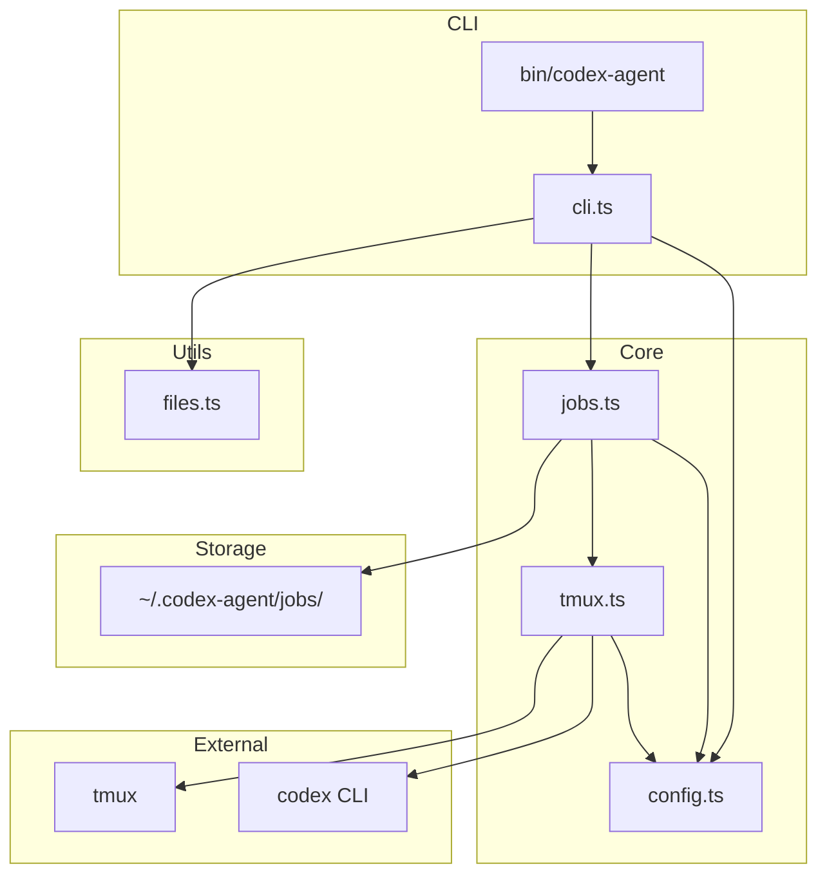
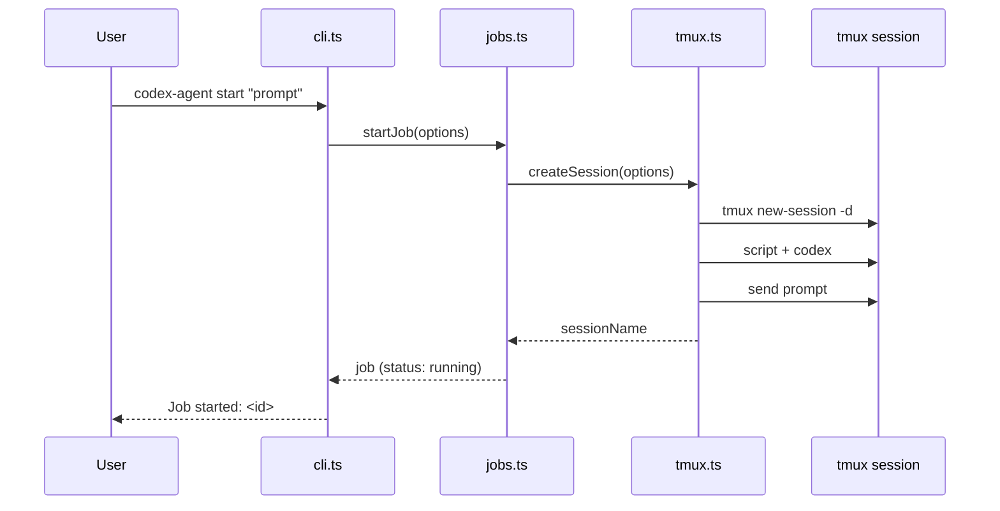
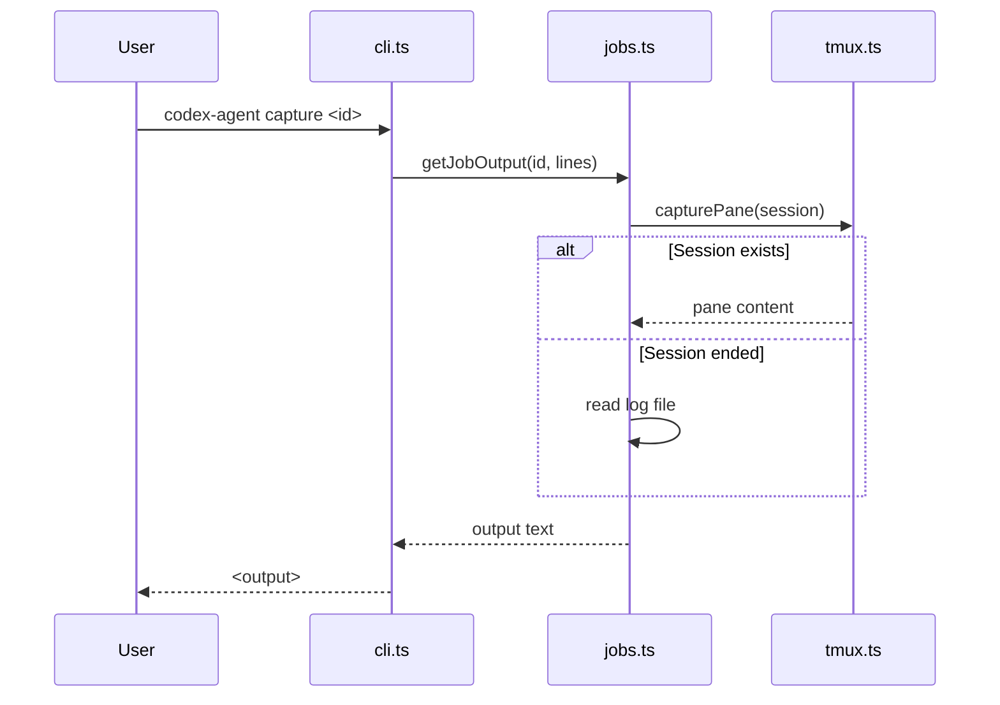

# Codebase Map

> Auto-generated by Cartographer. Last mapped: 2026-01-16

## System Overview

CLI tool for delegating tasks to GPT Codex agents via tmux sessions. Designed for Claude Code orchestration with bidirectional communication.



## Directory Structure

```
codex-agent/
├── bin/
│   └── codex-agent      # Shell wrapper (47 tokens)
├── src/
│   ├── cli.ts           # Main CLI entry point (3,912 tokens)
│   ├── config.ts        # Configuration constants (192 tokens)
│   ├── files.ts         # File loading utilities (589 tokens)
│   ├── jobs.ts          # Job lifecycle management (1,905 tokens)
│   └── tmux.ts          # tmux session management (2,296 tokens)
├── docs/
│   └── CODEBASE_MAP.md  # This file
├── .gitignore
└── package.json
```

## Module Guide

### bin/codex-agent

**Purpose**: Shell wrapper to execute TypeScript CLI with Bun runtime

**Key Logic**: Resolves script directory dynamically, passes all args to cli.ts

---

### src/config.ts

**Purpose**: Central configuration and type definitions

**Exports**:
| Export | Type | Description |
|--------|------|-------------|
| `config` | object | All configuration constants |
| `ReasoningEffort` | type | "low" \| "medium" \| "high" \| "xhigh" |
| `SandboxMode` | type | "read-only" \| "workspace-write" \| "danger-full-access" |

**Key Values**:
- `model`: "gpt-5.3-codex-spark"
- `jobsDir`: `~/.codex-agent/jobs`
- `tmuxPrefix`: "codex-agent"
- `defaultTimeout`: 60 minutes

---

### src/files.ts

**Purpose**: File loading utilities for context injection into prompts

**Exports**:
| Export | Description |
|--------|-------------|
| `loadFiles(patterns, baseDir)` | Load files matching glob patterns |
| `estimateTokens(text)` | Rough token count (~4 chars/token) |
| `formatPromptWithFiles(prompt, files)` | Inject files as markdown code blocks |
| `loadCodebaseMap(cwd)` | Find CODEBASE_MAP.md or ARCHITECTURE.md |

**Dependencies**: `glob` npm package

**Filters Applied**:
- Skip binary files (null byte detection)
- Skip files > 500KB
- Deduplicate matches
- Support negation patterns (!)

---

### src/tmux.ts

**Purpose**: Low-level tmux session management

**Exports**:
| Export | Description |
|--------|-------------|
| `getSessionName(jobId)` | Generate prefixed session name |
| `isTmuxAvailable()` | Check tmux installed |
| `sessionExists(name)` | Check session exists |
| `createSession(options)` | Create detached session with codex |
| `sendMessage(name, msg)` | Send text to session |
| `sendControl(name, key)` | Send control keys |
| `capturePane(name, opts)` | Capture visible output |
| `captureFullHistory(name)` | Capture scrollback buffer |
| `killSession(name)` | Terminate session |
| `listSessions()` | List all codex-agent sessions |
| `isSessionActive(name)` | Check if process running |
| `watchSession(name, cb, interval)` | Poll for updates |

**Key Behaviors**:
- Uses `script` command to log all output
- Auto-dismisses codex update prompts (sends "3")
- Long prompts (>5000 chars) use load-buffer instead of send-keys
- Completion marker: "[codex-agent: Session complete"

---

### src/jobs.ts

**Purpose**: High-level job lifecycle and persistence

**Exports**:
| Export | Description |
|--------|-------------|
| `Job` | Interface for job metadata |
| `startJob(options)` | Create and start new job |
| `loadJob(id)` | Load job from storage |
| `saveJob(job)` | Persist job to JSON |
| `listJobs()` | List all jobs (sorted by date) |
| `deleteJob(id)` | Delete job and cleanup |
| `killJob(id)` | Forcefully terminate |
| `sendToJob(id, msg)` | Send message to running job |
| `getJobOutput(id, lines?)` | Get recent output |
| `getJobFullOutput(id)` | Get complete output |
| `refreshJobStatus(id)` | Update status from tmux |
| `cleanupOldJobs(days)` | Remove old completed jobs |

**Job Status Lifecycle**: pending -> running -> completed | failed

**Storage**: JSON files in `~/.codex-agent/jobs/`

---

### src/cli.ts

**Purpose**: Main CLI entry point and command routing

**Commands**:
| Command | Description |
|---------|-------------|
| `start <prompt>` | Start new agent job |
| `status <id>` | Show job details |
| `send <id> <msg>` | Send message to running job |
| `capture <id> [lines]` | Get recent output (default: 50) |
| `output <id>` | Get full session output |
| `attach <id>` | Get tmux attach command |
| `watch <id>` | Stream output updates |
| `jobs` | List all jobs |
| `sessions` | List active tmux sessions |
| `kill <id>` | Terminate job |
| `clean` | Remove jobs older than 7 days |
| `delete <id>` | Delete specific job |
| `health` | Check tmux and codex availability |

**Options**:
| Option | Description |
|--------|-------------|
| `-r, --reasoning` | low, medium, high, xhigh |
| `-m, --model` | Model name |
| `-s, --sandbox` | read-only, workspace-write, danger-full-access |
| `-f, --file` | Include files (glob, repeatable) |
| `-d, --dir` | Working directory |
| `--map` | Include codebase map |
| `--dry-run` | Preview without executing |

---

## Data Flow

### Job Creation



### Output Retrieval



## Storage Structure

```
~/.codex-agent/jobs/
├── <jobId>.json        # Job metadata (status, model, timestamps)
├── <jobId>.prompt      # Original prompt text
└── <jobId>.log         # Terminal output from script command
```

## Conventions

- **Session naming**: `codex-agent-<8-char-hex-id>`
- **Job IDs**: 8 random hex characters (4 bytes)
- **Output capture**: tmux pane first, log file fallback
- **Completion detection**: marker string + session existence check

## Gotchas

1. **Fixed delays**: Uses hardcoded sleep values (0.3-1s) for tmux TUI sync
2. **Update prompt skip**: Automatically sends "3" to dismiss codex updates
3. **Shell escaping**: Single quotes escaped as `'\''`
4. **Platform**: Unix-like only (requires tmux, script command)
5. **Log files**: May contain ANSI terminal codes
6. **Large outputs**: 50MB buffer limit on captureFullHistory

## Navigation Guide

**To add a new CLI command**:
- Add case in `src/cli.ts` switch statement
- Add help text to HELP constant

**To change default config**:
- Edit `src/config.ts`

**To modify job storage**:
- Edit `src/jobs.ts` (save/load functions)

**To change tmux behavior**:
- Edit `src/tmux.ts` (createSession for startup, sendMessage for input)

**To add file filtering**:
- Edit `src/files.ts` (loadFiles function)
