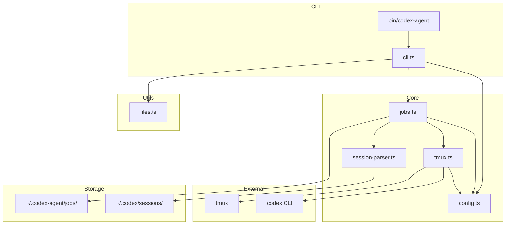
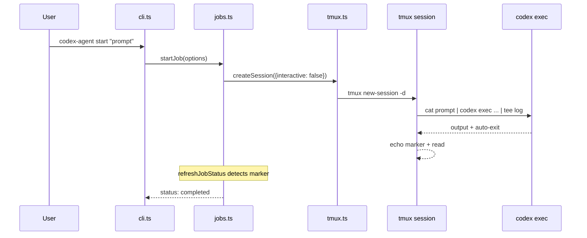
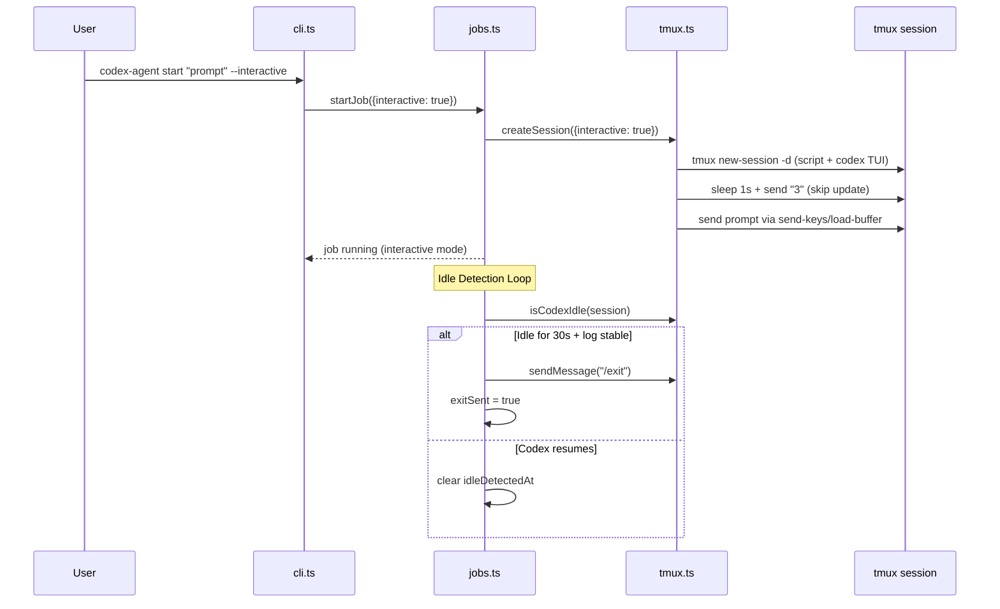
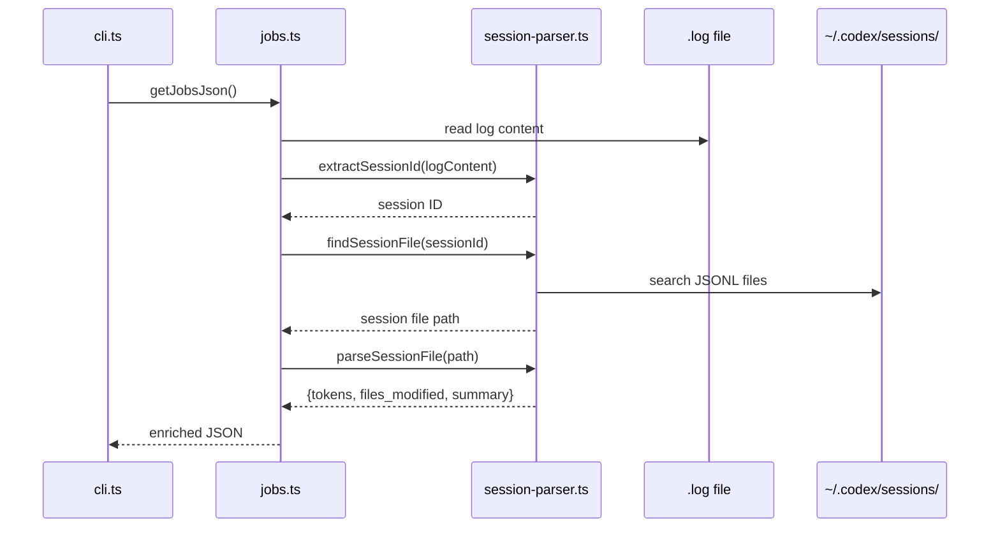

# Codebase Map

> Auto-generated by Cartographer. Last mapped: 2026-02-13T03:54:08Z

## System Overview

CLI tool for delegating tasks to GPT Codex agents via tmux sessions. Supports dual execution modes: **exec** (default, auto-completes) and **interactive** (TUI with idle detection + send support). Designed for Claude Code orchestration.



## Directory Structure

```
codex-orchestrator/
├── bin/
│   └── codex-agent              # Shell wrapper (102 tokens)
├── src/
│   ├── cli.ts                   # CLI entry point + command routing (4,930 tokens)
│   ├── config.ts                # Configuration constants + types (241 tokens)
│   ├── files.ts                 # File loading for context injection (589 tokens)
│   ├── jobs.ts                  # Job lifecycle, persistence, idle detection (3,350 tokens)
│   ├── session-parser.ts        # Parse Codex JSONL for enrichment (1,855 tokens)
│   └── tmux.ts                  # tmux session management (2,491 tokens)
├── docs/
│   ├── CODEBASE_MAP.md          # This file
│   ├── usage-guide.md           # Usage patterns for Claude Code (2,290 tokens)
│   └── codex-orchestrator-vs-opus-standalone.md  # Comparison doc (1,283 tokens)
├── plugins/codex-orchestrator/
│   ├── .claude-plugin/plugin.json  # Plugin metadata (64 tokens)
│   ├── skills/codex-orchestrator/
│   │   ├── SKILL.md             # Skill instructions for Claude (6,327 tokens)
│   │   └── assets/agents.log.template  # Log template (444 tokens)
│   ├── scripts/install.sh       # Dependency installer (2,143 tokens)
│   ├── README.md                # Plugin README (855 tokens)
│   └── LICENSE                  # MIT license (219 tokens)
├── .claude-plugin/
│   └── marketplace.json         # Marketplace registry (210 tokens)
├── .claude/
│   └── settings.local.json      # Local Claude settings (1,067 tokens)
├── CLAUDE.md                    # Project instructions (2,633 tokens)
├── README.md                    # Project README (2,135 tokens)
├── package.json                 # Bun dependencies (282 tokens)
└── .gitignore                   # Git ignore rules (50 tokens)
```

## Module Guide

### bin/codex-agent

**Purpose**: Shell wrapper — resolves script directory, invokes `bun run src/cli.ts` with all args.

---

### src/config.ts (241 tokens)

**Purpose**: Central configuration constants and type exports.

**Exports**: `config` object, `ReasoningEffort` type, `SandboxMode` type

| Key | Default | Description |
|-----|---------|-------------|
| model | `gpt-5.3-codex` | Default Codex model |
| defaultReasoningEffort | `xhigh` | Reasoning level |
| defaultSandbox | `workspace-write` | Sandbox mode |
| defaultTimeout | 60 | Inactivity timeout (minutes) |
| jobsListLimit | 20 | Max jobs shown in listings |
| tmuxPrefix | `codex-agent` | tmux session name prefix |
| idleDetectionEnabled | `true` | Interactive idle detection |
| idleGracePeriodSeconds | 30 | Idle grace period |

**Dependents**: All src/ modules

---

### src/files.ts (589 tokens)

**Purpose**: File loading utilities for context injection into agent prompts.

**Exports**:
| Export | Description |
|--------|-------------|
| `loadFiles(patterns, baseDir)` | Load files matching glob patterns |
| `estimateTokens(text)` | Rough token count (~4 chars/token) |
| `formatPromptWithFiles(prompt, files)` | Inject files as markdown code blocks |
| `loadCodebaseMap(cwd)` | Find CODEBASE_MAP.md or ARCHITECTURE.md |

**Dependencies**: `glob` npm package

**Filters**: Skip binary files (null byte), skip >500KB, deduplicate, support negation patterns

---

### src/tmux.ts (2,491 tokens)

**Purpose**: Low-level tmux session management with dual-mode support.

**Exports**:
| Export | Description |
|--------|-------------|
| `getSessionName(jobId)` | Generate `codex-agent-<id>` name |
| `isTmuxAvailable()` | Check tmux installed |
| `sessionExists(name)` | Check session exists |
| `createSession(options)` | Create detached session (exec or interactive) |
| `isCodexIdle(name)` | Check if TUI is idle (interactive only) |
| `sendMessage(name, msg)` | Send text + Enter to session |
| `sendControl(name, key)` | Send control keys (e.g. Ctrl+C) |
| `capturePane(name, opts)` | Capture visible output |
| `captureFullHistory(name)` | Capture full scrollback (50MB limit) |
| `killSession(name)` | Terminate session |
| `listSessions()` | List all codex-agent sessions |
| `isSessionActive(name)` | Check if pane process running |
| `watchSession(name, cb, interval)` | Poll for output updates |

**Internal**: `getExecApprovalFlag(sandbox)` maps sandbox mode to `--full-auto` / `--dangerously-bypass-approvals-and-sandbox`

**Key Behaviors**:
- **Exec mode**: `cat prompt | codex exec -m MODEL -c model_reasoning_summary="concise" -s SANDBOX FLAG --json - 2>&1 | tee LOG`
- **Interactive mode**: `script -q LOG codex ARGS` + sleep/send-keys timing + update prompt skip ("3" + Enter)
- Long prompts (>5000 chars): `load-buffer` instead of `send-keys`
- `isCodexIdle`: strips ANSI codes, checks for `? for shortcuts` pattern

---

### src/jobs.ts (3,350 tokens)

**Purpose**: High-level job lifecycle, persistence, idle detection, and enrichment.

**Exports**:
| Export | Description |
|--------|-------------|
| `Job` | Interface for job metadata |
| `startJob(options)` | Create job + tmux session |
| `loadJob(id)` | Load from JSON |
| `saveJob(job)` | Persist to JSON |
| `listJobs()` | List all (sorted by date) |
| `deleteJob(id)` | Delete job + cleanup |
| `killJob(id)` | Force terminate |
| `sendToJob(id, msg)` | Send to interactive job (returns `{sent, error?}`) |
| `sendControlToJob(id, key)` | Send control key |
| `getJobOutput(id, lines?)` | Recent output (pane → log fallback) |
| `getJobFullOutput(id)` | Full output |
| `refreshJobStatus(id)` | Update status from tmux state |
| `cleanupOldJobs(days)` | Remove old completed/failed jobs |
| `getJobsJson()` | Enriched JSON output with tokens/files/summary |

**Job Interface** (key fields):
| Field | Type | Description |
|-------|------|-------------|
| interactive? | boolean | Whether interactive TUI mode |
| idleDetectedAt? | string | ISO timestamp of first idle detection |
| exitSent? | boolean | Whether /exit was sent |

**refreshJobStatus flow**:
1. tmux session gone → completed
2. Marker `[codex-agent: Session complete` found → completed
3. Interactive + idle detected + grace period passed + log mtime stable → send `/exit`
4. Idle cleared if codex resumes (false positive recovery)
5. Inactivity timeout (60 min) → failed

**sendToJob**: Blocks non-interactive (exec mode) jobs with error message. Clears idle state on send.

---

### src/session-parser.ts (1,855 tokens)

**Purpose**: Parse Codex CLI session JSONL files for job enrichment data.

**Exports**:
| Export | Description |
|--------|-------------|
| `extractSessionId(logContent)` | Find session ID from log file |
| `findSessionFile(sessionId)` | Locate JSONL in `~/.codex/sessions/` |
| `parseSessionFile(path)` | Parse session → tokens, files, summary |

**Parsed Data**:
- **tokens**: input, output, context_window, context_used_pct
- **files_modified**: extracted from `apply_patch` tool calls (Update/Add/Delete/Move prefixes)
- **summary**: last assistant message text

**Internal functions**: `parseJsonlSession` (JSONL format), `parseJsonSession` (JSON format), `extractFilesFromPatch`, `extractAssistantText`

---

### src/cli.ts (4,930 tokens)

**Purpose**: CLI entry point — argument parsing, command routing, output formatting.

**Commands**: start, status, send, capture, output, attach, watch, jobs, sessions, kill, clean, delete, health

**Key Options**: `-r` reasoning, `-m` model, `-s` sandbox, `-f` file globs, `-d` dir, `--interactive`, `--map`, `--dry-run`, `--strip-ansi`, `--json`, `--limit`, `--all`

**Internal**: `parseArgs`, `formatDuration`, `formatJobStatus`, `stripAnsiCodes`, `refreshJobsForDisplay`, `sortJobsRunningFirst`, `applyJobsLimit`

---

### plugins/codex-orchestrator/skills/codex-orchestrator/SKILL.md (6,327 tokens)

**Purpose**: Skill instructions for Claude Code — defines the orchestration pipeline, prompt engineering guidance, error recovery, and mode selection.

**Key Sections**: 5-stage pipeline, Codex 5.3 constraint blocks, exec vs interactive selection guide, agent timing, error recovery

---

### plugins/codex-orchestrator/scripts/install.sh (2,143 tokens)

**Purpose**: Install script for dependencies (tmux, Bun, OpenAI Codex CLI, codex login, PATH setup).

## Data Flow

### Exec Mode (Default)



### Interactive Mode



### Job Enrichment



## Storage Structure

```
~/.codex-agent/jobs/
├── <jobId>.json        # Job metadata (status, model, timestamps, idle state)
├── <jobId>.prompt      # Original prompt text
└── <jobId>.log         # Terminal output (exec: tee, interactive: script)

~/.codex/sessions/      # Codex CLI session data (external)
└── <sessionId>.jsonl   # JSONL records (token counts, tool calls, messages)
```

## Conventions

- **Session naming**: `codex-agent-<8-char-hex-id>`
- **Job IDs**: 8 random hex characters (`randomBytes(4)`)
- **Output capture**: tmux pane first, `.log` file fallback
- **Completion detection**: exec → codex exit + marker; interactive → idle detection + `/exit`
- **Prompt escaping**: single quotes → `'\''`
- **Long prompts**: >5000 chars use `tmux load-buffer` + `paste-buffer`
- **ANSI stripping**: `--strip-ansi` flag for clean output

## Gotchas

1. **Hardcoded delays**: Interactive mode uses `sleep` 0.3–1s for tmux TUI sync — fragile but necessary
2. **Update prompt skip**: Sends "3" + Enter — breaks if Codex CLI changes update prompt UI
3. **Idle false positives**: TUI redraws may briefly show `? for shortcuts`; mitigated by 30s grace + log mtime check
4. **exitSent flag**: Prevents duplicate `/exit` sends during repeated `refreshJobStatus` calls
5. **50MB buffer**: `captureFullHistory` maxBuffer limit; very long sessions may truncate
6. **Log format differences**: exec mode produces JSON output, interactive produces raw terminal output — `session-parser.ts` handles both JSONL and JSON
7. **send blocks exec**: `sendToJob` returns error for non-interactive jobs
8. **Platform**: Unix-only (requires tmux, script command)
9. **Codex CLI auth**: Requires `codex --login` or API credits (ChatGPT Plus subscription is NOT sufficient)

## Navigation Guide

**To add a new CLI command**:
- Add case in `src/cli.ts` switch statement + update HELP constant

**To change default config**:
- Edit `src/config.ts` config object

**To modify job lifecycle**:
- Edit `src/jobs.ts` (startJob, refreshJobStatus, saveJob/loadJob)

**To change tmux/codex session behavior**:
- Edit `src/tmux.ts` (createSession for startup, sendMessage for input)

**To adjust idle detection**:
- Config: `src/config.ts` (idleGracePeriodSeconds, idleDetectionEnabled)
- Logic: `src/jobs.ts` refreshJobStatus (idle detection branch)
- Pattern: `src/tmux.ts` isCodexIdle

**To modify job enrichment**:
- Edit `src/session-parser.ts` (JSONL parsing, patch extraction)

**To add file filtering for context injection**:
- Edit `src/files.ts` (loadFiles, formatPromptWithFiles)

**To update plugin/skill behavior**:
- Edit `plugins/codex-orchestrator/skills/codex-orchestrator/SKILL.md`
