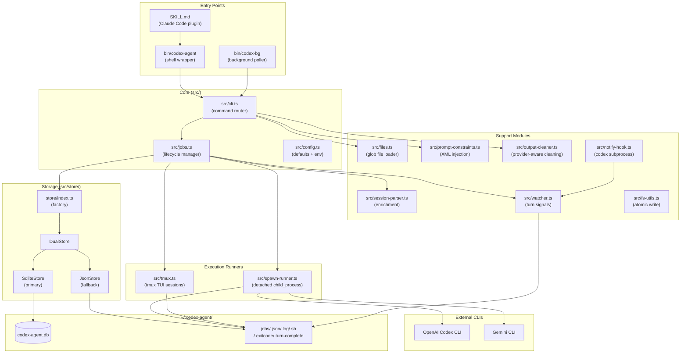
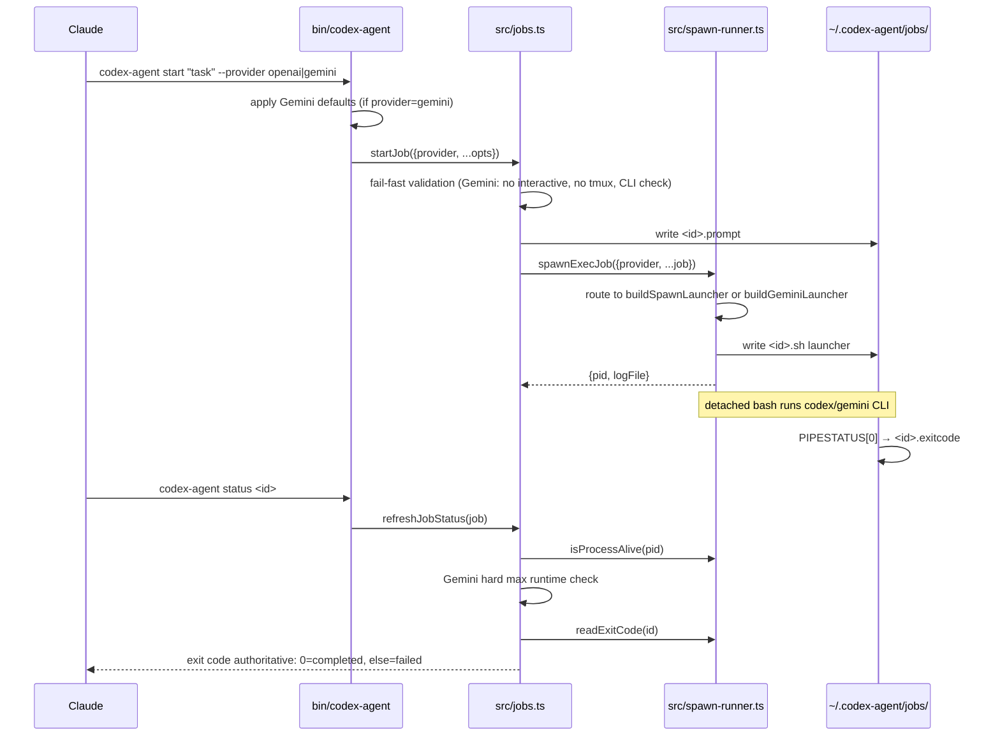
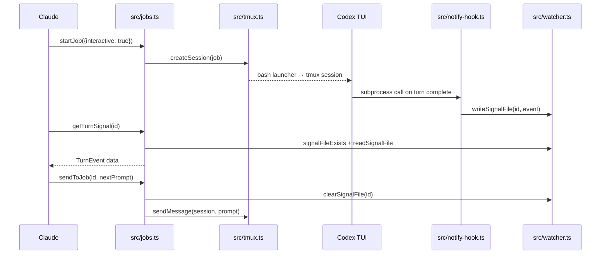
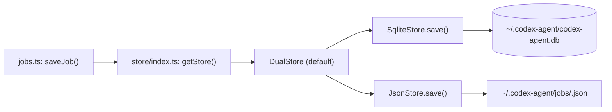

# Codebase Map

> Auto-generated by Cartographer. Last mapped: 2026-02-23

## System Overview


```mermaid
graph TB
    subgraph Entry["Entry Points"]
        BinAgent["bin/codex-agent<br>(shell wrapper)"]
        BinBg["bin/codex-bg<br>(background poller)"]
        SKILL["SKILL.md<br>(Claude Code plugin)"]
    end

    subgraph Core["Core (src/)"]
        CLI["src/cli.ts<br>(command router)"]
        Jobs["src/jobs.ts<br>(lifecycle manager)"]
        Config["src/config.ts<br>(defaults + env)"]
    end

    subgraph Runners["Execution Runners"]
        Spawn["src/spawn-runner.ts<br>(detached child_process)"]
        Tmux["src/tmux.ts<br>(tmux TUI sessions)"]
    end

    subgraph Storage["Storage (src/store/)"]
        StoreIdx["store/index.ts<br>(factory)"]
        Dual["DualStore"]
        SQLite["SqliteStore<br>(primary)"]
        JSON["JsonStore<br>(fallback)"]
    end

    subgraph Support["Support Modules"]
        Files["src/files.ts<br>(glob file loader)"]
        Constraints["src/prompt-constraints.ts<br>(XML injection)"]
        Parser["src/session-parser.ts<br>(enrichment)"]
        Watcher["src/watcher.ts<br>(turn signals)"]
        Cleaner["src/output-cleaner.ts<br>(provider-aware cleaning)"]
        FsUtils["src/fs-utils.ts<br>(atomic write)"]
        Hook["src/notify-hook.ts<br>(codex subprocess)"]
    end

    subgraph External["External CLIs"]
        CodexCLI["OpenAI Codex CLI"]
        GeminiCLI["Gemini CLI"]
    end

    subgraph Data["~/.codex-agent/"]
        DB[("codex-agent.db")]
        JobFiles["jobs/<id>.json/.log/.sh<br>/.exitcode/.turn-complete"]
    end

    BinAgent --> CLI
    BinBg --> CLI
    SKILL --> BinAgent
    CLI --> Jobs
    CLI --> Files
    CLI --> Constraints
    CLI --> Cleaner
    Jobs --> Spawn
    Jobs --> Tmux
    Jobs --> StoreIdx
    Jobs --> Parser
    Jobs --> Watcher
    StoreIdx --> Dual
    Dual --> SQLite
    Dual --> JSON
    SQLite --> DB
    JSON --> JobFiles
    Spawn --> JobFiles
    Spawn --> CodexCLI
    Spawn --> GeminiCLI
    Tmux --> JobFiles
    Hook --> Watcher
    Watcher --> JobFiles
```

## Directory Structure

```
codex-orchestrator/
├── bin/
│   ├── codex-agent          # Shell wrapper → src/cli.ts (symlink-safe)
│   └── codex-bg             # Background poller with turn-complete signal watch
├── src/
│   ├── cli.ts               # CLI entry: command parsing + routing hub
│   ├── config.ts            # All defaults + env override reading
│   ├── files.ts             # Glob-based file loader for context injection
│   ├── fs-utils.ts          # Atomic write + secure dir creation
│   ├── jobs.ts              # Job lifecycle: start/save/load/kill/refresh
│   ├── notify-hook.ts       # Codex subprocess: writes turn-complete signal
│   ├── output-cleaner.ts    # ANSI stripping + TUI noise filtering
│   ├── output-cleaner.test.ts  # Bun test runner unit tests
│   ├── prompt-constraints.ts   # XML constraint block injection
│   ├── session-parser.ts    # Parse ~/.codex/sessions/ JSONL for enrichment
│   ├── spawn-runner.ts      # Detached child_process exec runner
│   ├── tmux.ts              # tmux session ops (interactive mode)
│   ├── watcher.ts           # File-based turn-complete signaling
│   └── store/
│       ├── job-store.ts     # JobStore interface definition
│       ├── index.ts         # Factory: getStore() singleton
│       ├── json-store.ts    # JSON file backend
│       ├── sqlite-store.ts  # SQLite backend (bun:sqlite, WAL)
│       └── dual-store.ts    # Dual-write transitional layer
├── plugins/
│   └── codex-orchestrator/
│       ├── .claude-plugin/plugin.json  # Plugin metadata
│       ├── scripts/install.sh          # Automated installer
│       ├── README.md                   # Plugin marketplace README
│       └── skills/codex-orchestrator/
│           ├── SKILL.md                # Claude Code skill instructions
│           └── assets/agents.log.template  # Deprecated log template
├── docs/
│   ├── usage-guide.md                         # Developer workflow guide (zh-TW)
│   ├── opus-plan.md                           # Opus 4.6 PRD for multi-provider support
│   ├── codex-orchestrator-vs-claude-octopus.md  # System comparison doc
│   └── plan-multi-provider-consensus.md       # Multi-provider roadmap plan
├── codex-plan.codex.md                        # Codex 5.3 PRD for multi-provider (comparison)
├── .claude-plugin/marketplace.json   # Marketplace registry
├── .claude/plans/                    # Implementation plan archives
├── bin/codex-agent                   # Shell entry point
├── package.json                      # Bun/NPM manifest (glob dep only)
├── CLAUDE.md                         # Dev guidance for Claude Code
├── CHANGELOG.md                      # Version history (v0.1.0 → v2.0.0)
└── README.md                         # Primary user documentation
```

## Module Guide

### CLI (`src/cli.ts`)

**Purpose**: Main command router with multi-provider support; all user-facing operations flow through here.
**Entry point**: `src/cli.ts` (shebang, calls `main()`)
**Key files**:
| File | Purpose | Tokens |
|------|---------|--------|
| `src/cli.ts` | Command dispatch hub | 8,287 |

**Exports**: none (executable)
**Dependencies**: All major modules — config (`Provider`), jobs, files, prompt-constraints, tmux, output-cleaner
**Key behaviors**:
- `switch(command)` dispatch; unknown commands treated as prompts (passed to `startJob`)
- `--provider openai|gemini` flag with validation against `config.providers`
- Gemini defaults: three-phase arg parse → explicitness tracking (`sandboxExplicit`, `modelExplicit`, `noConstraintsExplicit`) → apply Gemini defaults post-loop (sandbox=`read-only`, model=`gemini-3.1-pro-preview`, noConstraints=`true`) only when not explicitly overridden
- Provider visibility: shown in dry-run, start, status, jobs table (`PROVIDER` column), capture, output, watch
- `cleanTerminalOutput` called with `job.provider ?? "openai"` for provider-aware output cleaning
- `migrate` and `verify-storage` use dynamic `require()` to load store implementations
- `watch` command tracks byte-offset on log file to avoid duplicate output
- `--keep-alive` implicitly sets `--interactive`
- Bug fix: tmux check now only for interactive mode (spawn mode no longer requires tmux)
- Bug fix: `tmux session:` output guarded with `if (job.tmuxSession)`

---

### Config (`src/config.ts`)

**Purpose**: Single source of truth for all defaults and env-based overrides, including multi-provider configuration.
**Key files**:
| File | Purpose | Tokens |
|------|---------|--------|
| `src/config.ts` | Defaults + env reading + Provider type | 698 |

**Exports**: `config`, `ReasoningEffort`, `SandboxMode`, `StorageMode`, `ExecRunner`, `Provider`
**Config values**:

| Key | Default | Env Override |
|-----|---------|-------------|
| model | `gpt-5.4` | — |
| defaultReasoningEffort | `xhigh` | — |
| defaultSandbox | `workspace-write` | — |
| defaultTimeout | 60 min | — |
| interactiveTimeout | 120 min | — |
| idleGracePeriodSeconds | 30 | — |
| storageMode | `dual` | `CODEX_AGENT_STORAGE` |
| execRunner | `spawn` | `CODEX_AGENT_EXEC_RUNNER` |
| sqliteDbPath | `~/.codex-agent/codex-agent.db` | — |
| jobsDir | `~/.codex-agent/jobs/` | — |
| tmuxPrefix | `codex-agent` | — |
| maxFileCount | 200 | — |
| provider | `openai` | `CODEX_AGENT_PROVIDER` |
| geminiDefaultModel | `gemini-3.1-pro-preview` | `CODEX_AGENT_GEMINI_MODEL` |
| geminiHardMaxRuntimeMinutes | 30 | `CODEX_AGENT_GEMINI_HARD_MAX_MINUTES` |

**Types**: `Provider = "openai" | "gemini"` — `config.providers` is a `readonly` const tuple `["openai", "gemini"]`

**Gotcha**: `storageMode` and `execRunner` are read at module load time — changing env after first import has no effect.

---

### Jobs (`src/jobs.ts`)

**Purpose**: Job lifecycle coordination layer with multi-provider support — creates, saves, refreshes, kills, and queries jobs.
**Key files**:
| File | Purpose | Tokens |
|------|---------|--------|
| `src/jobs.ts` | Job lifecycle hub | 5,206 |

**Exports**: `Job`, `JobsJsonEntry`, `JobsJsonOutput`, `StartJobOptions`, `saveJob`, `loadJob`, `listJobs`, `getJobsJson`, `deleteJob`, `startJob`, `killJob`, `sendToJob`, `sendControlToJob`, `getJobOutput`, `getJobFullOutput`, `cleanupOldJobs`, `isJobRunning`, `refreshJobStatus`, `isJobIdle`, `getTurnSignal`, `getAttachCommand`
**Key behaviors**:
- `provider?: Provider` on `Job` and `StartJobOptions` — optional for backward compat, defaults via `?? "openai"`
- `startJob` fail-fast validation for Gemini: no interactive mode, no tmux runner, checks `which gemini`
- `refreshJobStatus` dispatches to `refreshSpawnJob` or `refreshTmuxJob` based on `job.runner`
- **Exit code authoritative**: non-zero exit = `failed`, regardless of completion marker (bug fix)
- **Gemini hard max runtime**: kills process + sets `failed` if elapsed > `geminiHardMaxRuntimeMinutes` (prevents silent hangs)
- Enrichment caching: session parse results stored in `job.enrichment`; **skipped for non-openai providers** (session-parser only handles Codex JSONL)
- Inactivity timeout uses log mtime as activity proxy, falling back to `startedAt`
- Re-reads store after mutations (calls `loadJob` at end, not returning mutated local copy)

---

### Execution Runners

**Spawn Runner** (`src/spawn-runner.ts`) — default for exec mode, provider-routed
| File | Purpose | Tokens |
|------|---------|--------|
| `src/spawn-runner.ts` | Detached child_process runner with provider-specific launchers | 1,376 |

- Routes to `buildSpawnLauncher` (OpenAI) or `buildGeminiLauncher` (Gemini) based on `options.provider`
- Both launchers use `PIPESTATUS[0]` (not `$?`) to capture provider exit code, not `tee` exit
- OpenAI launcher: `codex exec -p '' --model <model> -r <reasoning> -s <sandbox> -c model_reasoning_summary=concise`
- Gemini launcher: `gemini -p '' <sandboxFlag> -m <model> -o text`; sandbox mapping: `read-only` → `-s`, others → `--yolo`
- Generates `.sh` launcher per job; spawns `bash <launcher>` detached with `unref()`
- `set -uo pipefail` ensures exit code write even if `tee` fails
- `isProcessAlive`: uses `process.kill(pid, 0)` probe
- Launcher files written with `0o700` permissions

**Tmux Runner** (`src/tmux.ts`) — required for interactive mode
| File | Purpose | Tokens |
|------|---------|--------|
| `src/tmux.ts` | tmux session operations | 3,204 |

- All tmux calls use `spawnSync` argv arrays (no shell interpolation)
- OS detection: BSD `script -q logfile cmd` vs GNU `script -q -c cmd logfile`
- Hardcoded `sleep 1` before sending prompt (TUI sync delay — fragile but necessary)
- 50MB `maxBuffer` for `captureFullHistory`
- `watchSession` export exists but is unused by `cli.ts` (log-file polling used instead)

---

### Storage (`src/store/`)

**Purpose**: `JobStore` interface + 3 backends with lazy factory.
**Key files**:
| File | Purpose | Tokens |
|------|---------|--------|
| `src/store/job-store.ts` | Interface: `save`, `load`, `list`, `remove` | 78 |
| `src/store/index.ts` | `getStore()` factory singleton | 218 |
| `src/store/json-store.ts` | File-per-job JSON backend | 388 |
| `src/store/sqlite-store.ts` | bun:sqlite WAL backend (schema v3) | 2,505 |
| `src/store/dual-store.ts` | Dual-write transitional layer | 416 |

**Patterns**:
- `DualStore` (default): writes to both, reads from SQLite with JSON fallback
- `SqliteStore`: WAL mode, schema migration via `PRAGMA table_info` check, `SCHEMA_VERSION = 3` (v3 adds `provider TEXT NOT NULL DEFAULT 'openai'`)
- `JsonStore`: one JSON file per job; `list()` reads all `.json` files sorted by `createdAt`
- `getStore()` caches singleton; SQLite/Dual loaded via dynamic `require()` to avoid circular imports

**Gotchas**:
- `DualStore.list()` returns only SQLite results — JSON-only jobs invisible if backfill hasn't run
- `watcher.ts:updateJobTurn` writes the `.json` file directly, bypassing the store abstraction (potential dual-write inconsistency)
- `bun:sqlite` only — not portable to Node.js

---

### File System Utilities (`src/fs-utils.ts`)

**Purpose**: Atomic file writes and secure directory creation.
**Exports**: `atomicWriteFileSync`, `ensureDirSync`
- Atomic write: temp file (PID + timestamp) + `renameSync`
- `ensureDirSync`: `mkdirSync` with `recursive: true` (idempotent)

---

### File Loader (`src/files.ts`)

**Purpose**: Glob-based file loading for context injection into prompts.
**Exports**: `FileContent`, `loadFiles`, `estimateTokens`, `formatPromptWithFiles`, `loadCodebaseMap`
- Negation patterns (`!glob`) supported
- Hard limits: 500KB per file, 200 files max, path boundary enforcement
- `loadCodebaseMap`: checks `docs/CODEBASE_MAP.md` → `CODEBASE_MAP.md` → `docs/ARCHITECTURE.md`

---

### Prompt Constraints (`src/prompt-constraints.ts`)

**Purpose**: Auto-injects XML constraint blocks into all Codex prompts.
**Exports**: `injectConstraints`
- Appends `<design_and_scope_constraints>` and `<context_loading>` blocks
- Deduplication via substring check (idempotent)
- `--no-constraints` flag in CLI bypasses injection

---

### Output Cleaner (`src/output-cleaner.ts`)

**Purpose**: Provider-aware terminal output cleaner — strips ANSI/control sequences and applies provider-specific noise removal.
**Exports**: `stripControlSequences`, `stripAnsiCodes`, `cleanTerminalOutput`
- `cleanTerminalOutput(text, provider)` dispatches to `cleanOpenAiChrome` (aggressive, 7-pass: markers → noise glyphs → URL artifacts → suffix stripping → noise lines → typing artifacts → dedup) or `cleanGeminiChrome` (conservative: dedup + blank-line collapse only)
- `stripControlSequences` exported as provider-agnostic primitive
- All ANSI regexes are module-level constants to avoid recompilation
- `isLikelyTypingArtifact` heuristic (short-word ratio, doubled char pairs) — OpenAI only; may false-positive on short lines
- `cleanGeminiChrome` is intentionally minimal — Gemini outputs plain text, aggressive stripping would corrupt content

---

### Session Parser (`src/session-parser.ts`)

**Purpose**: Parses Codex `~/.codex/sessions/` JSONL to extract token usage, files modified, summary.
**Exports**: `SessionTokens`, `ParsedSessionData`, `extractSessionId`, `findSessionFile`, `parseSessionFile`
- Stack-based DFS traversal of sessions directory
- Dual format: `.jsonl` (primary) and `.json` (legacy items array)
- `extractSessionId` has its own local ANSI stripping (does not reuse `output-cleaner.ts`)

---

### Turn Signaling (`src/watcher.ts` + `src/notify-hook.ts`)

**Purpose**: File-based turn-complete signaling between Codex subprocess and orchestrator.
**Exports** (watcher): `TurnEvent`, `writeSignalFile`, `readSignalFile`, `clearSignalFile`, `signalFileExists`, `updateJobTurn`, `setJobTurnWorking`
- Signal file (`<jobId>.turn-complete`) is transient: written by `notify-hook.ts`, consumed by `cli.ts:await-turn`, cleared on send/kill
- `notify-hook.ts`: invoked as Codex subprocess; reads `argv[2]` (jobId), `argv[3]` (JSON payload); silently exits on missing args or wrong type

---

### Plugin Structure (`plugins/codex-orchestrator/`)

**Purpose**: Claude Code plugin marketplace entry — skills, install script, and metadata.
**Key files**:
| File | Purpose | Tokens |
|------|---------|--------|
| `.claude-plugin/plugin.json` | Plugin metadata (name, author) | 64 |
| `scripts/install.sh` | Multi-platform installer | 2,143 |
| `skills/.../SKILL.md` | Claude Code skill instruction set (with multi-provider patterns) | 10,382 |
| `assets/agents.log.template` | **Deprecated** — replaced by `jobs --json` | 444 |

**SKILL.md key rules**:
- 7-stage pipeline: Ideation → Research → Synthesis → PRD → Implementation → Review → Testing
- Trivial task bypass: single file <50 lines → Claude handles directly, no agent spawn
- Mandatory XML blocks: `<design_and_scope_constraints>`, `<context_loading>`, `<plan_first>`
- Turn-aware orchestration: `await-turn` for blocking on agent turns
- **Multi-Provider Patterns**: Pattern A (Parallel Analysis — both providers analyze same code), Pattern B (Generate → Adversarial Review — sequential), Pattern C (Specialist Routing — single best provider)
- **Synthesis Protocol**: Anonymous Alpha/Beta relabeling → 4-step evidence-based checklist (enumerate differences → steel-man unique findings → require technical rebuttal → preserve unrebutted)
- Self-reported scoring (`Security: X/10`) explicitly banned; provider agreement ≠ correctness
- Parallel sandbox safety: at least one provider must be read-only in Pattern A

---

### Bin Scripts

| File | Purpose |
|------|---------|
| `bin/codex-agent` | Symlink-safe shell wrapper → `src/cli.ts` via `bun` |
| `bin/codex-bg` | Background job poller; watches `.turn-complete` signal files; runs notify command on completion |

---

### Documentation

| File | Purpose |
|------|---------|
| `README.md` | User-facing: install, commands, security model |
| `docs/usage-guide.md` | Developer workflow guide (zh-TW): 8 scenarios (incl. multi-provider), plugin update procedure, skill comparison |
| `docs/opus-plan.md` | Opus 4.6 PRD for multi-provider support — authoritative design document with 5 key decisions |
| `docs/codex-orchestrator-vs-claude-octopus.md` | Comparison: Three Skill combo vs Claude Octopus |
| `docs/plan-multi-provider-consensus.md` | Roadmap plan for `--provider openai\|gemini` flag |
| `codex-plan.codex.md` | Codex 5.3 PRD for multi-provider (comparison plan — parallel to opus-plan.md) |
| `CHANGELOG.md` | Version history v0.1.0 → v2.0.0 (P0/P1/P2 refactor phases) |

## Entry Points

| Entry Point | File | Description |
|-------------|------|-------------|
| CLI main | `bin/codex-agent` → `src/cli.ts` | Primary user/Claude entry point |
| Background poller | `bin/codex-bg` | Background job polling with turn signals |
| Installer | `plugins/codex-orchestrator/scripts/install.sh` | Multi-platform automated install |
| Claude Code plugin | `plugins/codex-orchestrator/skills/codex-orchestrator/SKILL.md` | Auto-triggers on coding tasks |
| Notify hook | `src/notify-hook.ts` | Codex subprocess callback |

## Data Models & Schema

### Job Record (`Job` interface)

```typescript
{
  id: string            // 8 hex chars
  status: 'running' | 'completed' | 'failed' | 'killed'
  runner: 'spawn' | 'tmux'
  provider?: Provider   // "openai" | "gemini" — optional for backward compat, defaults "openai"
  prompt: string
  model: string
  reasoning: string
  sandbox: string
  interactive: boolean
  pid?: number          // spawn runner only
  exitCode?: number     // spawn runner only
  tmuxSession?: string  // tmux runner only
  logFile: string
  createdAt: string     // ISO timestamp
  startedAt?: string
  completedAt?: string
  turnCount?: number
  currentTurn?: TurnEvent
  enrichment?: {        // cached after first parse; null for non-openai providers
    tokens: SessionTokens
    filesModified: string[]
    summary: string
  }
}
```

### SQLite Schema (v3)

- Table: `jobs` — all Job fields serialized
- v2 migration: `pid`, `exit_code`, `runner` columns added
- v3 migration: `provider TEXT NOT NULL DEFAULT 'openai'` column added (existing rows auto-default)
- WAL mode enabled; `ensureDirSync` with 0o700 permissions on DB directory
- `PRAGMA table_info` guard on all migrations to prevent duplicate column errors

### File-based Artifacts (`~/.codex-agent/jobs/`)

| File | Purpose |
|------|---------|
| `<id>.json` | Job metadata (0o600) |
| `<id>.prompt` | Original prompt text |
| `<id>.log` | Full terminal output (ANSI codes) |
| `<id>.sh` | Per-job launcher script |
| `<id>.exitcode` | Exit code from spawn runner |
| `<id>.turn-complete` | Turn signal (transient) |

## External Integrations

| Service | Purpose | Config Location |
|---------|---------|-----------------|
| OpenAI Codex CLI (`codex`) | Agent execution backend (default provider) | `codex --login` |
| Gemini CLI (`gemini`) | Agent execution backend (optional 2nd provider) | `npm i -g @anthropic-ai/gemini-cli` |
| `bun` runtime | TypeScript execution, SQLite | PATH |
| `tmux` | Interactive mode session management | PATH (optional for exec mode) |
| `glob` npm package | File pattern matching | `package.json` |

## Data Flow

### Exec Mode (Spawn Runner — Default, Provider-Routed)


```mermaid
sequenceDiagram
    participant Claude
    participant CLI as bin/codex-agent
    participant Jobs as src/jobs.ts
    participant Spawn as src/spawn-runner.ts
    participant FS as ~/.codex-agent/jobs/

    Claude->>CLI: codex-agent start "task" --provider openai|gemini
    CLI->>CLI: apply Gemini defaults (if provider=gemini)
    CLI->>Jobs: startJob({provider, ...opts})
    Jobs->>Jobs: fail-fast validation (Gemini: no interactive, no tmux, CLI check)
    Jobs->>FS: write <id>.prompt
    Jobs->>Spawn: spawnExecJob({provider, ...job})
    Spawn->>Spawn: route to buildSpawnLauncher or buildGeminiLauncher
    Spawn->>FS: write <id>.sh launcher
    Spawn-->>Jobs: {pid, logFile}
    Note over Spawn,FS: detached bash runs codex/gemini CLI
    FS->>FS: PIPESTATUS[0] → <id>.exitcode

    Claude->>CLI: codex-agent status <id>
    CLI->>Jobs: refreshJobStatus(job)
    Jobs->>Spawn: isProcessAlive(pid)
    Jobs->>Jobs: Gemini hard max runtime check
    Jobs->>Spawn: readExitCode(id)
    Jobs-->>Claude: exit code authoritative: 0=completed, else=failed
```

### Interactive Mode (Tmux Runner)


```mermaid
sequenceDiagram
    participant Claude
    participant Jobs as src/jobs.ts
    participant Tmux as src/tmux.ts
    participant Codex as Codex TUI
    participant Hook as src/notify-hook.ts
    participant Watch as src/watcher.ts

    Claude->>Jobs: startJob({interactive: true})
    Jobs->>Tmux: createSession(job)
    Tmux-->>Codex: bash launcher → tmux session
    Codex->>Hook: subprocess call on turn complete
    Hook->>Watch: writeSignalFile(id, event)
    Claude->>Jobs: getTurnSignal(id)
    Jobs->>Watch: signalFileExists + readSignalFile
    Jobs-->>Claude: TurnEvent data
    Claude->>Jobs: sendToJob(id, nextPrompt)
    Jobs->>Watch: clearSignalFile(id)
    Jobs->>Tmux: sendMessage(session, prompt)
```

### Storage Write Path


```mermaid
graph LR
    Save["jobs.ts: saveJob()"] --> Factory["store/index.ts: getStore()"]
    Factory --> Dual["DualStore (default)"]
    Dual --> SQLite["SqliteStore.save()"]
    Dual --> JSON["JsonStore.save()"]
    SQLite --> DB[("~/.codex-agent/codex-agent.db")]
    JSON --> File["~/.codex-agent/jobs/<id>.json"]
```

## Conventions

- **Atomic writes**: All JSON and signal file writes use `atomicWriteFileSync` (tmp + `renameSync`)
- **Argv-safe tmux**: All `spawnSync` calls use argv arrays — no shell string interpolation
- **Shell quoting in launchers**: `shellQuote()` uses `'\''` technique for bash-safe embedding
- **Bun-only**: `bun:sqlite` used throughout; not portable to Node.js
- **ES modules**: `"type": "module"` in `package.json`; dynamic `require()` used in store factory to avoid circular imports
- **Permissions**: Jobs dir created with `0o700`; job JSON files written with `0o600`

## Gotchas

- **`watcher.ts:updateJobTurn` bypasses store abstraction** — writes `.json` directly, creating potential dual-write inconsistency with SQLite
- **`session-parser.ts` duplicates ANSI stripping** — `extractSessionId` has its own regex instead of reusing `output-cleaner.ts`
- **`findSessionFile` matches by substring** — potential false-positives for similar session IDs
- **Idle detection regex** (`? for shortcuts`) can briefly appear during Codex TUI redraws; 30s grace period mitigates false-positives
- **`store/_store` singleton never resets** — changing `CODEX_AGENT_STORAGE` env after first `getStore()` call has no effect in same process
- **`codex-agent` wrapper defaults to `~/.codex-orchestrator/bin/`** (upstream install), not local dev path — use `bun run src/cli.ts` for local testing
- **`agents.log.template` is deprecated** — SKILL.md explicitly discourages shared agents.log to avoid multi-Claude race conditions; use `jobs --json` instead
- **50MB buffer limit** for `captureFullHistory`
- **hardcoded `sleep 1`** in `tmux.ts` before sending prompt — fragile TUI sync, necessary for tmux/Codex startup timing
- **`DualStore.list()` returns SQLite only** — JSON-only jobs invisible until backfill completes
- **Exit code behavior change** — non-zero exit + completion marker now correctly becomes `failed` (previously was `completed`); existing workflows relying on marker override will see different behavior
- **Gemini enrichment is always `null`** — session-parser only handles Codex JSONL; `getJobsJson` skips enrichment for non-openai providers
- **Gemini silent hang risk** — ambiguous prompts via stdin may cause Gemini to wait indefinitely; mitigated by `geminiHardMaxRuntimeMinutes` hard kill (default 30 min)
- **`provider` field backward compat** — old jobs without `provider` field use `?? "openai"` fallback everywhere; SQLite v3 migration auto-defaults existing rows to `'openai'`
- **CHROME_CUT_MARKERS regex `lastIndex`** — explicitly reset inside `truncateAtFirstMarker` (needed for non-global regexes with `exec`)

## Navigation Guide

**To add a new CLI command**: Edit `src/cli.ts` `switch(command)` block + add relevant logic in `src/jobs.ts`

**To add a new job field**: Update `Job` interface in `src/jobs.ts` → update `SqliteStore` schema + migration in `src/store/sqlite-store.ts` (increment `SCHEMA_VERSION`) → update `JsonStore` if needed

**To change Codex prompt behavior**: Edit `src/prompt-constraints.ts` (XML constraint blocks) or `plugins/codex-orchestrator/skills/codex-orchestrator/SKILL.md`

**To add a new storage backend**: Implement `JobStore` interface from `src/store/job-store.ts` → register in `src/store/index.ts` factory

**To change exec runner**: Set `CODEX_AGENT_EXEC_RUNNER=tmux` for legacy tmux exec mode; or modify `src/spawn-runner.ts`

**To add a new provider**: Add to `Provider` type in `src/config.ts` → add launcher in `src/spawn-runner.ts` → add fail-fast validation in `src/jobs.ts:startJob` → add cleaner in `src/output-cleaner.ts` → bump SQLite schema if needed → add patterns in SKILL.md. Currently uses `if/else`; refactor to `ProviderAdapter` interface when 3rd provider added.

**To debug job completion**: Check `~/.codex-agent/jobs/<id>.exitcode` (spawn) or tmux pane for `[codex-agent: Session complete` marker (tmux exec). Exit code is authoritative: non-zero = failed regardless of completion marker.

**To run multi-provider analysis**: Use Pattern A/B/C from SKILL.md. Start two jobs with `--provider openai` and `--provider gemini`, await both, then synthesize with anonymous Alpha/Beta relabeling per Synthesis Protocol.

**To update the plugin skill**: Sync changes to 3 locations — source (`plugins/codex-orchestrator/skills/.../SKILL.md`), marketplace clone (`~/.claude/plugins/marketplaces/codex-orchestrator/`), plugin cache (`~/.claude/plugins/cache/codex-orchestrator/`)
