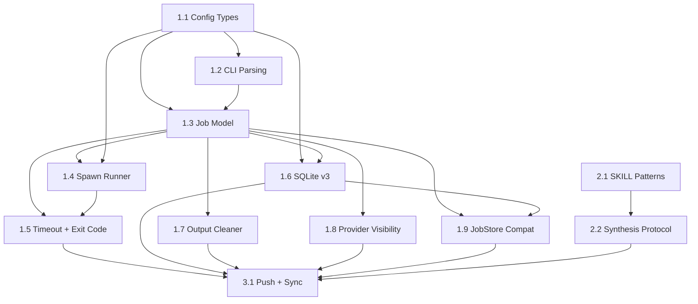

# Plan: Multi-Provider Support (OpenAI + Gemini) — Opus 4.6 PRD

**Generated**: 2026-02-23
**Author**: Claude Opus 4.6
**Estimated Complexity**: Medium
**Comparable plan**: `codex-plan.codex.md` (GPT-5.3-Codex)

---

## Problem Statement

`codex-orchestrator` hardcodes OpenAI Codex execution paths. Adding Gemini CLI as a second provider enables three orchestration patterns that Claude (as orchestrator) cannot currently perform: parallel cross-validation of analytical findings, generate-then-review workflows, and specialist routing by provider strength.

The design challenge is adding this capability without pulling a lean CLI toward orchestration-monolith territory (claude-octopus's 17,775-line trap).

## Design Philosophy

### The Framing Problem

The three prior analyses (Gemini, Codex, Sonnet) all evaluate the consensus mechanism *as designed*. The real question is whether "consensus" is even the right product concept.

**codex-orchestrator is a job multiplexer.** It starts jobs, tracks them, returns outputs. Adding `--provider gemini` is a natural extension — it's just another job type. **"Consensus mode" is an orchestration policy** — a decision about *what to do with* multiple outputs. That policy belongs in SKILL.md, not in CLI code.

### The Complexity Creep Test

After Phase 1 ships, if you find yourself wanting to add a single new CLI command or flag for consensus purposes, that's the signal you've crossed the line. Stop and write SKILL.md guidance instead.

## Design Decisions

### 1. CLI is a job multiplexer, not a consensus engine

- **Decision**: Add `--provider openai|gemini` only. No `--provider openai,gemini` multi-dispatch. No `groupId`. No `await-group`. No consensus subcommands.
- **Why I disagree with Codex**: Codex recommended `start --provider openai,gemini` returning `{groupId, jobs[]}`. This couples an orchestration pattern to the CLI interface. If the user later decides adversarial review (sequential) is better than parallel consensus, the multi-dispatch abstraction is wasted. Keep primitives orthogonal.
- **Where this lives**: Claude orchestrates multi-job dispatch via SKILL.md patterns — it already has `start`, `await-turn`, `output` primitives and can simply issue two `start` commands.

### 2. Three collaboration patterns replace "consensus mode"

The original plan assumed one pattern (parallel → synthesize). Analysis shows three patterns are needed:

| Pattern | When | Workflow |
|---------|------|----------|
| **A: Parallel analysis** | Reviewing existing code for bugs/security | Both providers analyze same code; different analytical styles = signal |
| **B: Generate → adversarial review** | Writing new code, refactoring | One generates, other critiques; avoids style-noise of parallel generation |
| **C: Specialist routing** | Context-heavy tasks (50+ files) | Send to whichever provider is better suited; no consensus needed |

### 3. Drop self-reported scoring entirely

- **Decision**: Remove any `Security: X/10` guidance from SKILL.md.
- **Evidence**: Gemini defaults to conservative calibration (its 8/10 ≈ Codex's 10/10). Both collapse to 8–10 without strict OWASP rubric. All four models agreed this is noise.
- **Replacement**: Evidence-based synthesis checklist (see Phase 2).

### 4. Anonymous synthesis to prevent provider-identity bias

- **Decision**: Before synthesis, relabel outputs as "Analysis Alpha" and "Analysis Beta" with randomized assignment. Do NOT reveal which model produced which until AFTER synthesis.
- **Why**: Claude brings prior beliefs about each model's strengths. Knowing "Gemini found X" unconsciously weights the finding by Claude's model of Gemini's reliability. This is the same principle as double-blind peer review.

### 5. Gemini defaults (safety-first)

| Setting | Gemini default | Why |
|---------|---------------|-----|
| `--no-constraints` | Auto-enabled | XML `<design_and_scope_constraints>` blocks are Codex-tuned; Gemini may ignore or misinterpret |
| Sandbox | `read-only` | Prevents filesystem races in parallel execution; explicit override required for write |
| Runner | `spawn` only | tmux runner is Codex TUI-specific; Gemini has no TUI |
| Enrichment | `null` | session-parser only handles Codex JSONL format |

### 6. Exit code is authoritative, completion marker is not

- **Decision**: Non-zero exit code = `failed`, regardless of completion marker presence.
- **Current bug**: `refreshSpawnJob()` (jobs.ts:497) treats completion marker as success override for non-zero exits. This is wrong — the marker is always written by the launcher regardless of exit code. Fix in this PR.
- **PIPESTATUS fix**: Use `${PIPESTATUS[0]}` instead of `$?` to capture provider process exit code, not pipeline (tee) status. Apply to BOTH launchers.

## Out of Scope

- Gemini interactive/TUI mode (tmux)
- Gemini enrichment parsing (tokens, files_modified, summary) — stays `null`
- Multi-dispatch CLI commands (`--provider openai,gemini`, `await-group`, `groupId`)
- Programmatic quality gates in code (score thresholds, finding-count thresholds, retry state machines)
- `ProviderAdapter` interface — use explicit `if/else` branching for 2 providers; refactor when 3rd provider is added
- `watch` command redesign for spawn-mode providers

---

## Phase 1: Multi-Provider CLI Runtime

**Goal**: Provider selection + safe Gemini execution + exit code correctness. ~120 lines of TypeScript.

### Task 1.1: Provider Types and Config Defaults

- **Files**: `src/config.ts`
- **Complexity**: 2/10
- **Dependencies**: None
- **Changes**:
  - Add `Provider` type: `"openai" | "gemini"`
  - Add config fields: `provider` (default `"openai"` via env `CODEX_AGENT_PROVIDER`), `providers` list, `geminiDefaultModel` (`"gemini-3.1-pro-preview"` via env `CODEX_AGENT_GEMINI_MODEL`), `geminiHardMaxRuntimeMinutes` (default 30 via env)
- **Acceptance**: `Provider` type exported; config exposes all four fields

```typescript
export type Provider = "openai" | "gemini";

// In config object:
provider: (process.env.CODEX_AGENT_PROVIDER || "openai") as Provider,
providers: ["openai", "gemini"] as const,
geminiDefaultModel: process.env.CODEX_AGENT_GEMINI_MODEL || "gemini-3.1-pro-preview",
geminiHardMaxRuntimeMinutes: Number(process.env.CODEX_AGENT_GEMINI_HARD_MAX_MINUTES || 30),
```

### Task 1.2: CLI Provider Parsing + Gemini Defaults + tmux Fix

- **Files**: `src/cli.ts`
- **Complexity**: 5/10
- **Dependencies**: Task 1.1
- **Changes**:
  - Add `provider: Provider` to `Options` interface (line 102)
  - Add `--provider` flag parsing with validation
  - Track explicitness for `--sandbox`, `--model`, `--no-constraints` (boolean flags `sandboxExplicit`, `modelExplicit`, `noConstraintsExplicit`)
  - After parsing, apply Gemini defaults: if provider=gemini and not explicit, set `sandbox="read-only"`, `model=config.geminiDefaultModel`, `noConstraints=true`
  - **Bug fix (line 327)**: `isTmuxAvailable()` check currently blocks ALL modes. Move inside `if (options.interactive)` — spawn mode does not need tmux
  - **Bug fix (line 387)**: `console.log(\`tmux session: ${job.tmuxSession}\`)` prints `undefined` for spawn jobs. Guard with `if (job.tmuxSession)`
  - Add `--provider` to HELP text, dry-run output, and examples
- **Acceptance**: `--provider invalid` exits with error; Gemini defaults apply when not explicitly overridden; spawn-mode no longer requires tmux

```typescript
// Explicitness tracking
let sandboxExplicit = false;
let modelExplicit = false;
let noConstraintsExplicit = false;

// In parse loop:
} else if (arg === "--provider") {
  const p = args[++i] as Provider;
  if (!(config.providers as readonly string[]).includes(p)) {
    console.error(`Invalid provider: ${p}. Valid: ${config.providers.join(", ")}`);
    process.exit(1);
  }
  options.provider = p;
}

// After parse loop, apply Gemini defaults:
if (options.provider === "gemini") {
  if (!sandboxExplicit) options.sandbox = "read-only";
  if (!modelExplicit) options.model = config.geminiDefaultModel;
  if (!noConstraintsExplicit) options.noConstraints = true;
}

// Bug fix: tmux check only for interactive
if (options.interactive && !isTmuxAvailable()) {
  console.error("Error: tmux required for interactive mode");
  process.exit(1);
}
```

### Task 1.3: Job Model + Provider Propagation + Compatibility Validation

- **Files**: `src/jobs.ts`
- **Complexity**: 5/10
- **Dependencies**: Task 1.1, Task 1.2
- **Changes**:
  - Add `provider?: Provider` to `Job` interface (line 24, near `runner?`)
  - Add `provider?: Provider` to `StartJobOptions` (line 242)
  - In `startJob()` (line 253): resolve provider default, validate incompatibilities
  - **Fail-fast validation**: Gemini + tmux runner = error; Gemini + interactive = error; Gemini CLI not installed = error
  - Pass `provider` to `spawnExecJob()`
  - Add `provider` to `JobsJsonEntry` (line 139)
  - **Backward compat**: All reads of `job.provider` use `?? "openai"` fallback for old jobs without provider field

```typescript
// Validation in startJob():
if (provider === "gemini") {
  if (options.interactive) {
    throw new Error("Gemini does not support interactive mode.");
  }
  if (config.execRunner === "tmux") {
    throw new Error("Gemini requires spawn runner. Set CODEX_AGENT_EXEC_RUNNER=spawn.");
  }
  // Fail-fast: check Gemini CLI exists
  try {
    const { execSync } = require("child_process");
    execSync("which gemini", { stdio: "ignore" });
  } catch {
    throw new Error("Gemini CLI not found. Install: https://github.com/google-gemini/gemini-cli");
  }
}

// Job construction:
provider: options.provider ?? config.provider,

// In spawnExecJob call:
provider: job.provider ?? "openai",
```

### Task 1.4: Spawn Runner — Gemini Launcher + PIPESTATUS Fix

- **Files**: `src/spawn-runner.ts`
- **Complexity**: 6/10
- **Dependencies**: Task 1.1, Task 1.3
- **Changes**:
  - Add `provider` to `spawnExecJob` options
  - Add `buildGeminiLauncher()` function
  - Route launcher creation by provider
  - **PIPESTATUS fix in BOTH launchers**: Change `EXIT_CODE=$?` to `EXIT_CODE=${PIPESTATUS[0]}` — captures provider process exit, not `tee` exit
  - Gemini sandbox mapping: `read-only` → `-s`, `workspace-write`/`danger-full-access` → `--yolo`
- **Acceptance**: `spawnExecJob({provider:"gemini"})` produces correct Gemini launcher; `.exitcode` reflects provider exit code for both providers

```typescript
function buildGeminiLauncher(opts: {
  promptFile: string;
  logFile: string;
  exitCodeFile: string;
  model: string;
  sandbox: string;
}): string {
  const q = shellQuote;
  const sandboxFlag = opts.sandbox === "read-only" ? "-s" : "--yolo";
  return [
    "#!/bin/bash",
    "set -uo pipefail",
    "",
    `cat ${q(opts.promptFile)} | gemini -p '' ${sandboxFlag} -m ${q(opts.model)} -o text 2>&1 | tee ${q(opts.logFile)}`,
    "EXIT_CODE=${PIPESTATUS[0]}",
    "",
    `printf '\\n\\n[codex-agent: Session complete. Exit code: %d]\\n' $EXIT_CODE >> ${q(opts.logFile)}`,
    `echo $EXIT_CODE > ${q(opts.exitCodeFile)}`,
  ].join("\n");
}

// Also fix existing buildSpawnLauncher (line 48):
// Change: "EXIT_CODE=$?"
// To:     "EXIT_CODE=${PIPESTATUS[0]}"

// Router:
const launcher = options.provider === "gemini"
  ? buildGeminiLauncher({ promptFile, logFile, exitCodeFile, model: options.model, sandbox: options.sandbox })
  : buildSpawnLauncher({ promptFile, logFile, exitCodeFile, model: options.model, reasoningEffort: options.reasoningEffort, sandbox: options.sandbox });
```

### Task 1.5: Exit Code Authoritative + Hard Max Timeout + Skip Gemini Enrichment

- **Files**: `src/jobs.ts`
- **Complexity**: 7/10
- **Dependencies**: Task 1.1, Task 1.3, Task 1.4
- **Changes**:
  - **Exit code fix** in `refreshSpawnJob()` (line 495-498): Remove completion-marker override. Non-zero exit = `failed`, period. The marker only confirms the launcher script reached the end — it says nothing about the provider's success.
  - **Hard max runtime** for Gemini: In `refreshSpawnJob()`, if provider=gemini and wall clock exceeds `config.geminiHardMaxRuntimeMinutes`, kill and fail. This catches silent hangs (Gemini waiting for stdin input).
  - **Skip enrichment**: In `getJobsJson()` (line 171), skip `loadSessionData()` for non-openai providers (session-parser only handles Codex JSONL format).
- **Acceptance**: Non-zero exit + marker → `failed`; Gemini job killed at hard max; `jobs --json` shows null enrichment for Gemini

```typescript
// refreshSpawnJob — corrected logic:
if (exitCode === 0) {
  job.status = "completed";
} else {
  job.status = "failed";
  job.error = exitCode !== null
    ? `Process exited with code ${exitCode}`
    : "Process exited unexpectedly (no exit code file)";
}

// Hard max runtime check (while process alive):
if (job.provider === "gemini" || (job.provider ?? "openai") === "gemini") {
  const elapsedMs = computeElapsedMs(job);
  const hardMaxMs = config.geminiHardMaxRuntimeMinutes * 60 * 1000;
  if (elapsedMs > hardMaxMs) {
    try { process.kill(job.pid, "SIGTERM"); } catch {}
    job.status = "failed";
    job.error = `Gemini hard max runtime exceeded (${config.geminiHardMaxRuntimeMinutes} min)`;
    job.completedAt = new Date().toISOString();
    saveJob(job);
    return;
  }
}

// Skip enrichment for non-openai:
if (effective.status === "completed" && (effective.provider ?? "openai") === "openai") {
  // existing enrichment logic...
}
```

**Backward compatibility note**: The exit code fix changes behavior for existing OpenAI jobs too — previously, a non-zero exit with completion marker was marked `completed`. After this change, it correctly becomes `failed`. This is a bug fix, not a regression, but existing workflows that relied on the marker override will see different behavior.

### Task 1.6: SQLite Migration v2 → v3

- **Files**: `src/store/sqlite-store.ts`
- **Complexity**: 4/10
- **Dependencies**: Task 1.1, Task 1.3
- **Changes**:
  - Bump `SCHEMA_VERSION` to 3
  - Add migration: `ALTER TABLE jobs ADD COLUMN provider TEXT NOT NULL DEFAULT 'openai'`
  - Add `provider` to `JobRow` type, `jobToRow()`, `rowToJob()`, and `columns` list
  - Use PRAGMA check to avoid duplicate column error (same pattern as v2 migration)
- **Acceptance**: Existing v2 DB migrates without data loss; new rows include provider; round-trip preserves provider value

```typescript
const SCHEMA_VERSION = 3;

// In migrate():
if (fromVersion < 3) {
  const cols = this.db.prepare("PRAGMA table_info(jobs)").all() as { name: string }[];
  const existing = new Set(cols.map((c) => c.name));
  if (!existing.has("provider")) {
    this.db.exec("ALTER TABLE jobs ADD COLUMN provider TEXT NOT NULL DEFAULT 'openai'");
  }
}

// JobRow: add provider: string
// jobToRow: provider: job.provider ?? "openai"
// rowToJob: provider: (row.provider as Provider) ?? "openai" (with ?? "openai" fallback)
// columns: add "provider" after "runner"
```

### Task 1.7: Output Cleaner — Provider-Aware Split

- **Files**: `src/output-cleaner.ts`, `src/cli.ts`
- **Complexity**: 6/10
- **Dependencies**: Task 1.3
- **Changes**:
  - **Export** `stripControlSequences()` as provider-agnostic primitive
  - Rename existing cleaning logic to `cleanOpenAiChrome()` (private)
  - Add `cleanGeminiChrome()` — minimal: strip control sequences + collapse blank lines only. No Codex-specific heuristics (`CHROME_CUT_MARKERS`, `CHROME_ONLY_LINE_PATTERNS`, `isLikelyTypingArtifact`, etc.)
  - Change `cleanTerminalOutput(text)` signature to `cleanTerminalOutput(text, provider?: Provider)` — routes to provider-specific cleaner. Default `"openai"` for backward compat.
  - Update callers in `src/cli.ts` (lines 629, 648, 710): pass job provider to cleaner. For `capture`/`output` commands, load job to get provider; for `watch`, get provider from job.

```typescript
// Public API:
export function stripControlSequences(text: string): string { /* existing logic */ }

export function cleanTerminalOutput(text: string, provider: Provider = "openai"): string {
  const stripped = stripControlSequences(text);
  return provider === "openai"
    ? cleanOpenAiChrome(stripped)
    : cleanGeminiChrome(stripped);
}

// Gemini cleaner — conservative, don't over-strip:
function cleanGeminiChrome(text: string): string {
  const lines: string[] = [];
  let prev = "";
  for (const raw of text.split("\n")) {
    const line = raw.replace(/\uFFFD/g, "").trimEnd();
    // Collapse multiple blank lines
    if (!line.trim()) {
      if (lines.length > 0 && lines[lines.length - 1] !== "") lines.push("");
      continue;
    }
    if (line === prev) continue;
    lines.push(line);
    prev = line;
  }
  while (lines.length > 0 && lines[lines.length - 1] === "") lines.pop();
  return lines.join("\n");
}
```

### Task 1.8: Provider Visibility in CLI Output

- **Files**: `src/cli.ts`, `src/jobs.ts`
- **Complexity**: 3/10
- **Dependencies**: Task 1.3
- **Changes**:
  - Add provider to `formatJobStatus()` table output (line 238)
  - Add provider to `status` detail output (line 475 area)
  - Add provider to `JobsJsonEntry` (line 139)
  - Guard `tmux session:` output with `if (job.tmuxSession)` (line 387)
  - Add provider to dry-run output (line 361)
- **Acceptance**: `jobs`, `status`, `jobs --json` all show provider for every job

### Task 1.9: Verify JobStore Contract Compatibility

- **Files**: `src/store/job-store.ts`, all store implementations
- **Complexity**: 1/10
- **Dependencies**: Task 1.3, Task 1.6
- **Changes**: None expected — `JobStore` interface uses `Job` type which gains `provider` automatically. Verify with type check (`bun run build` or `tsc --noEmit`).
- **Acceptance**: All stores compile; no interface changes needed

---

## Phase 2: SKILL.md Multi-Provider Patterns (Documentation Only)

**Goal**: Replace scoring-based consensus with evidence-based multi-provider patterns.

### Task 2.1: Multi-Provider Patterns A/B/C

- **File**: `plugins/codex-orchestrator/skills/codex-orchestrator/SKILL.md`
- **Complexity**: 3/10
- **Dependencies**: None (can start independently of Phase 1)

Add after "Multi-Agent Patterns" section (~line 822):

```markdown
## Multi-Provider Patterns

### Pattern A: Parallel Analysis (reviewing existing code)
**When**: Analytical reasoning on project-specific code (bugs, security, architecture).
**Why**: Both providers analyze the SAME code; different analytical approaches = useful signal.
**Constraint**: At least one provider MUST be read-only to prevent filesystem races.

  codex-agent start "review src/auth.ts for vulnerabilities" --provider openai -s read-only --map
  codex-agent start "review src/auth.ts for vulnerabilities" --provider gemini --map
  # Gemini defaults to read-only; OpenAI explicitly set here
  # await both, then synthesize per Synthesis Protocol below

### Pattern B: Generate → Adversarial Review (code generation)
**When**: Implementing or refactoring features.
**Why**: Parallel generation produces style noise; sequential review produces substantive critique.

  codex-agent start "implement auth refactor per PRD" --provider openai --map
  # await completion, read output
  codex-agent start "review this implementation for correctness, security, and edge cases: [paste output]" --provider gemini --map
  # await, synthesize implementation + critique

### Pattern C: Specialist Routing (context-heavy tasks)
**When**: Task requires 50+ files, cross-service analysis, large log analysis.
**Why**: Gemini's context window advantage is decisive; single provider is sufficient.

  codex-agent start "analyze dependency graph across all services" --provider gemini --map
  # No consensus needed — specialist routing

### When NOT to Use Multi-Provider
- Pattern-recognition tasks on common code (JWT, bcrypt) — correlated training = correlated blind spots
- Vague specs ("make it better") — divergence reflects ambiguity, not quality
- Trivial tasks — cost and latency not justified
- Subjective preferences (naming, formatting) — consensus is coincidence
```

### Task 2.2: Synthesis Protocol + Task-Type Guidance + Sandbox Rules

- **File**: `plugins/codex-orchestrator/skills/codex-orchestrator/SKILL.md`
- **Complexity**: 4/10
- **Dependencies**: Task 2.1

```markdown
## Synthesis Protocol (Multi-Provider)

### Pre-Synthesis
1. Randomly relabel provider outputs as "Analysis Alpha" and "Analysis Beta".
   Do NOT reveal which model produced which until AFTER synthesis.

### Hard-Fail Preconditions (stop, do not synthesize)
- Either job status ≠ completed → report failure
- Either exit code ≠ 0 → report failure
- Either output is empty or clearly off-topic → flag and explain

### Synthesis Steps (all four required, in order)
1. **Enumerate differences** — List every divergence between Alpha and Beta.
   Do NOT evaluate or judge. Format: "Alpha says X; Beta says Y."

2. **Steel-man unique findings** — For each finding reported by only one analysis:
   argue FOR it. Cite specific code or context that supports it.
   Do NOT evaluate yet.

3. **Require technical rebuttal** — For each unique finding:
   attempt to rebut with specific code evidence.
   PROHIBITED: Labeling any finding as "false positive" without citing
   (a) specific code evidence and (b) why the analysis's reasoning is wrong.

4. **Preserve unrebutted** — If you cannot technically rebut a finding,
   it MUST appear in the final synthesis, even if you disagree with severity.

### Rules
- Never request or use self-reported scoring (e.g., Security: X/10)
- Output length is not a quality signal
- Agreement between providers is not proof of correctness (correlated training)
- For high-stakes tasks: use two separate synthesis passes (advocacy then judgment)
  to disrupt latent reasoning chain bias

## Parallel Sandbox Safety
- In Pattern A (parallel execution), at least one provider MUST run read-only
- Default: Gemini is read-only unless user explicitly sets sandbox
- If both need write access: run sequentially, not in parallel
```

---

## Phase 3: Sync and Distribution

### Task 3.1: Push + Sync Plugin Copies

- **Dependencies**: Phase 1 + Phase 2 complete
- **Complexity**: 2/10

```bash
git add src/ plugins/codex-orchestrator/skills/codex-orchestrator/SKILL.md
git commit -m "Add multi-provider support (--provider openai|gemini) and synthesis patterns"
git push

git -C ~/.claude/plugins/marketplaces/codex-orchestrator-marketplace pull
cp plugins/codex-orchestrator/skills/codex-orchestrator/SKILL.md \
   ~/.claude/plugins/cache/codex-orchestrator-marketplace/codex-orchestrator/1.0.0/skills/codex-orchestrator/SKILL.md
```

---

## Dependency Graph



Critical path: 1.1 → 1.2 → 1.3 → 1.4 → 1.5 → 3.1

Tasks with no incoming edges (can start immediately): 1.1, 2.1

Parallelizable after 1.3 completes: {1.4, 1.6, 1.7, 1.8, 1.9}

## Testing Strategy

### Build validation
```bash
bun run build   # must succeed with zero type errors
```

### CLI smoke tests
```bash
# Provider parsing
codex-agent start "test" --provider gemini --dry-run
# → should show: Provider: gemini, Model: gemini-3.1-pro-preview, Sandbox: read-only, noConstraints: true

codex-agent start "test" --provider gemini -s workspace-write --dry-run
# → Sandbox: workspace-write (explicit override preserved)

codex-agent start "test" --provider invalid 2>&1
# → error: Invalid provider

# tmux no longer required for spawn mode
# (with tmux uninstalled or unavailable):
codex-agent start "test" --provider openai --dry-run
# → should work (no tmux check for non-interactive)

# Gemini + tmux runner = error
CODEX_AGENT_EXEC_RUNNER=tmux codex-agent start "test" --provider gemini 2>&1
# → error: Gemini requires spawn runner

# Gemini + interactive = error
codex-agent start "test" --provider gemini --interactive 2>&1
# → error: Gemini does not support interactive mode
```

### Runtime correctness
```bash
# Success path
codex-agent start "list files in current directory" --provider gemini -s read-only -r medium --no-constraints
codex-agent await-turn <id>
codex-agent status <id>        # → status: completed, provider: gemini
codex-agent output <id> --clean

# Forced failure: verify exit code correctness
codex-agent start "run a nonexistent command 'foobar123'" --provider gemini
codex-agent await-turn <id>
codex-agent status <id>        # → status: failed (not completed)

# Hard max timeout (set low for testing)
CODEX_AGENT_GEMINI_HARD_MAX_MINUTES=1 codex-agent start "sleep 120" --provider gemini
# → should fail after 1 minute with hard max runtime error
```

### Storage migration
```bash
codex-agent verify-storage     # before: no provider column issues
# (run after migration)
codex-agent jobs --json --all | jq '.jobs[0].provider'  # → "openai" for old jobs
```

### Output cleaning
```bash
# Gemini output should not be over-stripped
codex-agent output <gemini-job-id> --clean
# → meaningful content preserved; only control sequences and blank line runs removed
```

## Key Differences from codex-plan.codex.md

| Aspect | Codex Plan | Opus Plan | Why |
|--------|-----------|-----------|-----|
| Gemini CLI check | Not mentioned | Fail-fast at `start` time | UX: clear error vs. mysterious spawn failure |
| PIPESTATUS scope | "Fix exit code" but unclear which launchers | Both launchers explicitly | Consistency; prevents new launcher copying old bug |
| Backward compat (exit code) | Implicit | Explicit note about behavior change for existing OpenAI jobs | Transparency; existing workflows may notice |
| JSON fallback | Not mentioned | `?? "openai"` on all `job.provider` reads | Old JSON jobs without provider field would show undefined |
| Mermaid graph | Missing T1.2→T1.3 edge, missing T1.9 | All edges present | Correct parallelism reasoning |
| Gemini model ID | `gemini-3.1-pro` | `gemini-3.1-pro-preview` | Correct model ID per Gemini 3.1 docs |
| ProviderAdapter | Not mentioned | Explicitly deferred with trigger condition | Design decision documented |
| Synthesis protocol | 4-step structure | Same 4-step + anonymous relabeling + two-pass option for high-stakes | Addresses provider-identity bias |

## Potential Risks

1. **Existing OpenAI job behavior change**: Exit code fix means non-zero exits with completion marker now correctly fail. Monitor for false failures.
2. **Gemini silent hang**: Ambiguous prompts via stdin may cause Gemini to wait for input. Mitigated by hard max runtime timeout.
3. **Output cleaning too conservative for Gemini**: Minimal Gemini cleaner may leave some noise. Acceptable — better to under-strip than over-strip meaningful content.
4. **Explicitness tracking complexity**: Three `*Explicit` booleans in CLI parser add state. Keep them local to `parseArgs()` scope.

## Rollback Plan

All changes are in a single commit. `git revert` reverts everything cleanly.

- SQLite migration is additive (adds column with default). Reverted code can still read the column as it falls through to `?? "openai"` fallback.
- SKILL.md changes are pure documentation. Revert independently if synthesis protocol causes workflow friction.
- If Gemini cleaner causes issues, temporarily route all cleaning through `stripControlSequences()` only (provider-agnostic path).

## Execution Order

1. **Implement 1.1 → 1.2 → 1.3** (provider plumbing, CLI parsing, job model)
2. **Implement 1.4** (launcher + PIPESTATUS fix)
3. **In parallel**: 1.5, 1.6, 1.7, 1.8, 1.9
4. **Build + type check**
5. **Run full testing matrix**
6. **Apply Phase 2** (SKILL.md edits)
7. **Phase 3** (push + sync)
